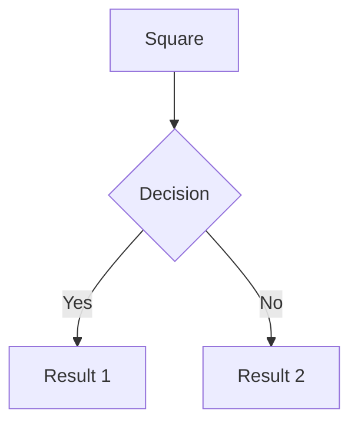
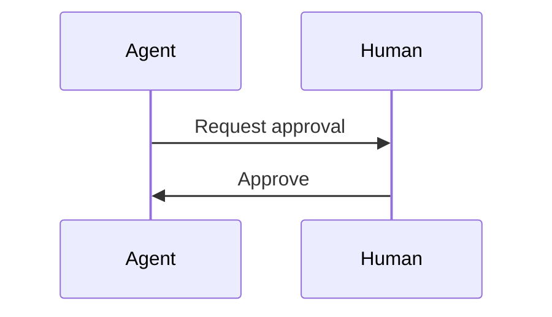
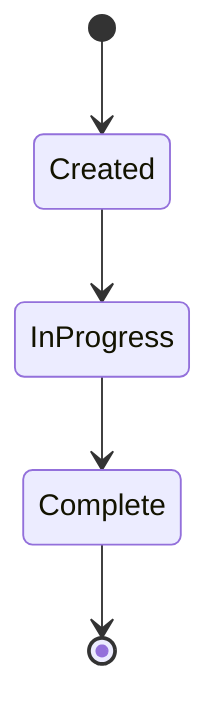
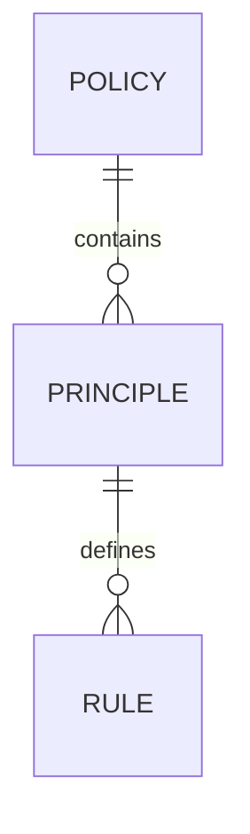
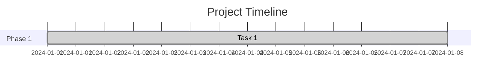
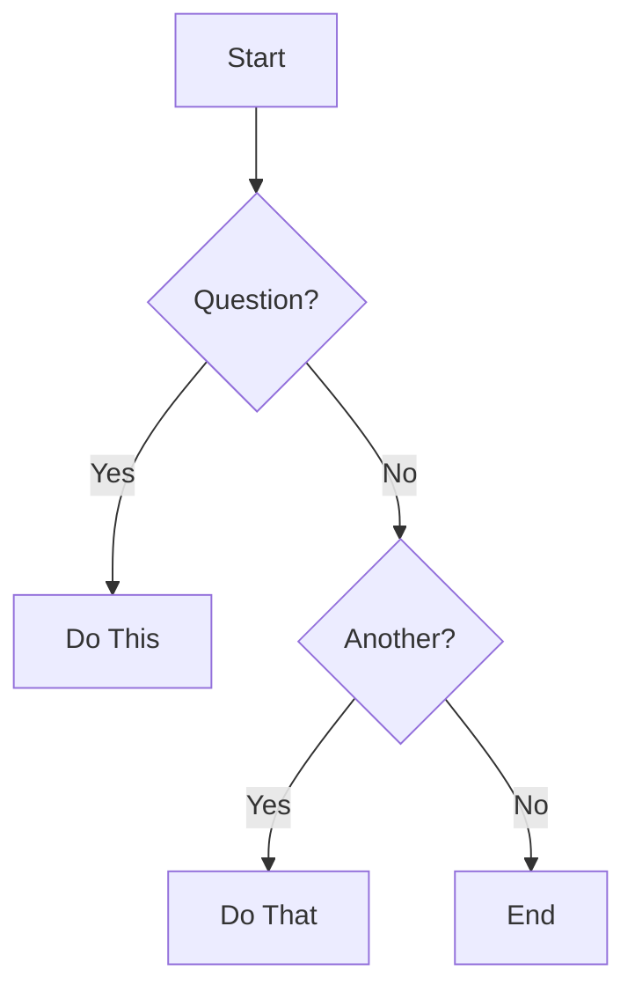
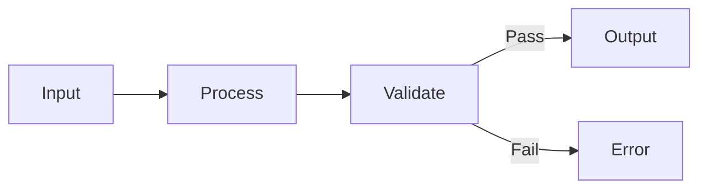
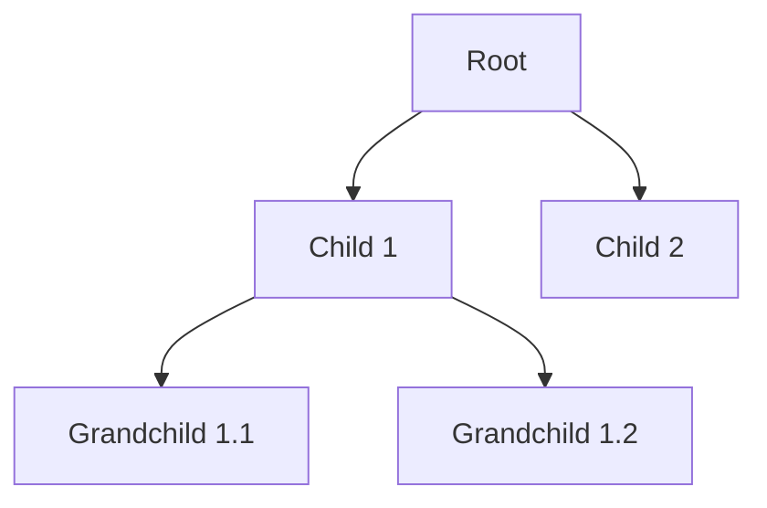

# Visual Documentation - Diagrams

This directory contains visual diagrams that help understand the governance framework architecture, workflows, and processes. All diagrams use Mermaid.js syntax and can be rendered in markdown viewers that support Mermaid.

## Available Diagrams

### Architecture Diagrams
1. **[system-architecture.md](system-architecture.md)** - Complete system architecture
2. **[authority-chain.md](authority-chain.md)** - Policy authority and decision flow
3. **[boundary-model.md](boundary-model.md)** - Layer architecture and boundaries
4. **[security-architecture.md](security-architecture.md)** - Security model and controls

### Workflow Diagrams
5. **[agent-execution-flow.md](agent-execution-flow.md)** - Agent three-pass execution
6. **[pr-workflow.md](pr-workflow.md)** - Pull request workflow with governance
7. **[waiver-lifecycle.md](waiver-lifecycle.md)** - Waiver request and approval flow

### Model Diagrams
8. **[maturity-model.md](maturity-model.md)** - Governance maturity progression
9. **[deployment-pipeline.md](deployment-pipeline.md)** - CI/CD pipeline stages

## How to View Diagrams

### In GitHub
GitHub automatically renders Mermaid diagrams in markdown files. Just open any diagram file to see it rendered.

### In VS Code
Install the "Markdown Preview Mermaid Support" extension:
```bash
code --install-extension bierner.markdown-mermaid
```

### Online
Copy the Mermaid code to:
- https://mermaid.live/
- https://mermaid-js.github.io/mermaid-live-editor/

### In Documentation Sites
Most modern documentation generators support Mermaid:
- Docusaurus
- MkDocs with pymdown-extensions
- GitBook
- VuePress

## Diagram Categories

### System Architecture
Shows the overall structure of the governance system, including:
- Components and their relationships
- Data flow
- Integration points
- Technology stack

### Authority & Decision Flow
Illustrates how governance decisions are made:
- Policy hierarchy
- Agent decision-making
- HITL escalation points
- Override mechanisms

### Boundaries & Layers
Defines architectural boundaries:
- Layer model (ui → domain → data → platform)
- Allowed dependencies
- Forbidden imports
- Enforcement mechanisms

### Workflows & Processes
Documents key workflows:
- Agent execution (three-pass process)
- Pull request lifecycle
- Waiver management
- Incident response

### Maturity & Evolution
Shows progression over time:
- Maturity levels (0-4)
- Capability development
- Upgrade paths
- Success metrics

## Creating New Diagrams

To add a new diagram:

1. **Create a new .md file** in this directory
2. **Use Mermaid syntax:**
   ```markdown
   # Diagram Title
   
   ## Overview
   Brief description of what the diagram shows.
   
   ## Diagram
   
   \`\`\`mermaid
   graph TD
       A[Start] --> B[Process]
       B --> C[End]
   \`\`\`
   
   ## Key Elements
   Explanation of diagram elements.
   ```

3. **Test the diagram:**
   - Preview in GitHub
   - Verify in VS Code
   - Check on mermaid.live

4. **Update this README** with a link to your diagram

## Mermaid Diagram Types

### Graph/Flowchart


### Sequence Diagram


### State Diagram


### Entity Relationship


### Gantt Chart


## Tips for Effective Diagrams

### Do:
- Keep diagrams focused on one concept
- Use clear, descriptive labels
- Add legends when needed
- Include explanatory text below the diagram
- Test on multiple renderers

### Don't:
- Create overly complex diagrams (split into multiple if needed)
- Use ambiguous labels
- Forget to document special notation
- Make diagrams too small (hard to read)
- Use colors that don't work in dark mode

## Common Patterns

### Decision Tree


### Process Flow


### Hierarchy


## Related Documentation

- **Architecture Overview:** `/docs/architecture/ARCHITECTURE_OVERVIEW.md`
- **Agent Architecture:** `/docs/architecture/AGENT_ARCHITECTURE.md`
- **Layer Model:** `/docs/architecture/LAYER_MODEL.md`
- **Security Architecture:** `/docs/architecture/SECURITY_ARCHITECTURE.md`

## Support

If you need help with Mermaid syntax:
- Official docs: https://mermaid.js.org/
- Live editor: https://mermaid.live/
- Examples: https://mermaid.js.org/ecosystem/tutorials.html

---

**Last Updated:** 2026-01-22  
**Total Diagrams:** 9  
**Format:** Mermaid.js
