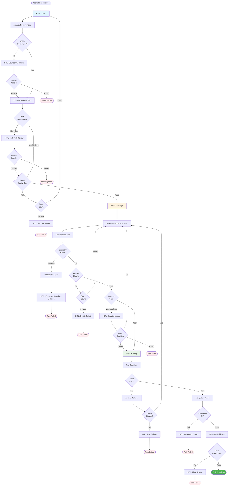
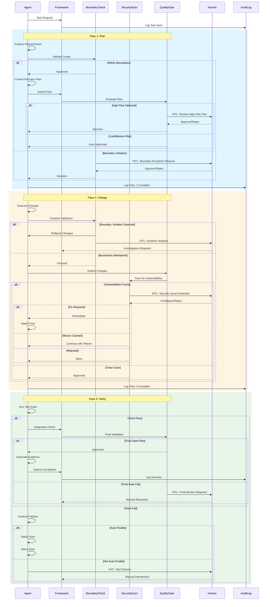
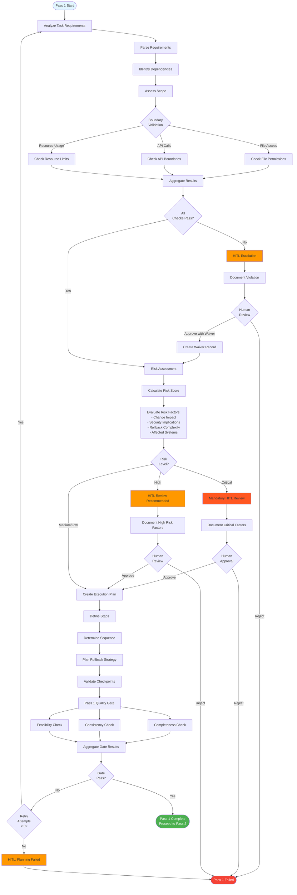
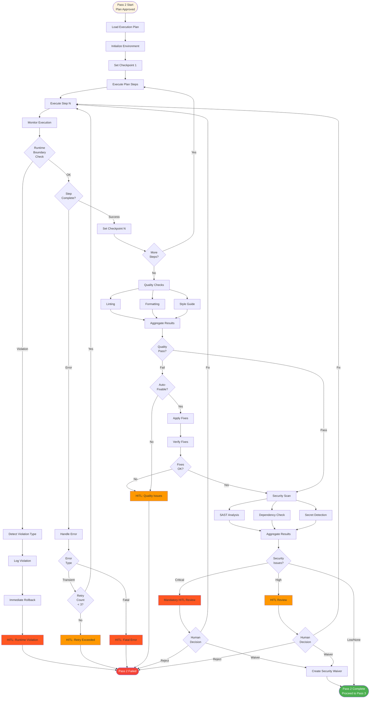
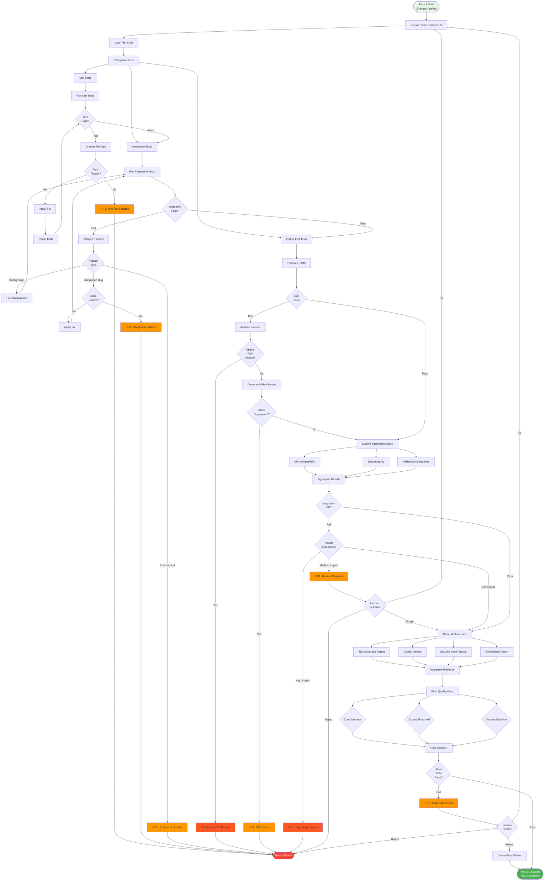
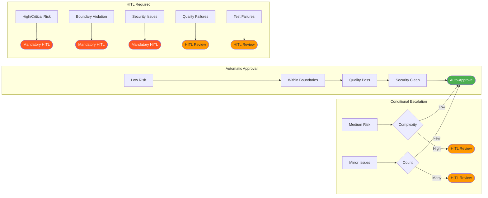

# Agent Execution Flow

## Overview

The Agent Execution Flow diagram illustrates the three-pass execution process that AI agents follow when making changes in the governance framework. This systematic approach ensures that agents plan thoroughly, execute precisely, and verify comprehensively, with multiple quality gates and Human-in-the-Loop (HITL) escalation points throughout the process.

The three-pass model—Plan, Change, Verify—provides a structured approach that balances automation efficiency with safety and compliance. Each pass has distinct objectives, decision points, and escalation paths to ensure that changes meet quality standards, stay within defined boundaries, and comply with security requirements.

## Three-Pass Execution Model



## Agent-to-Human Interaction Sequence



## Pass 1: Plan - Detailed Flow



## Pass 2: Change - Detailed Flow



## Pass 3: Verify - Detailed Flow



## Escalation Decision Matrix



## Key Principles

### 1. Progressive Validation
Each pass builds upon the previous one, with increasing levels of validation and verification. Pass 1 ensures the plan is sound, Pass 2 ensures the implementation is correct, and Pass 3 ensures the result is functional and integrates properly.

### 2. Defense in Depth
Multiple quality gates at each pass provide layered security and quality assurance. If one check misses an issue, subsequent checks will catch it.

### 3. Fail Fast
Issues are detected and escalated as early as possible. Boundary violations stop execution immediately, preventing wasted effort on changes that cannot be completed.

### 4. Human-in-the-Loop Escalation
Complex decisions, high-risk changes, and failures are escalated to humans. The system knows its limitations and requests help when needed.

### 5. Comprehensive Evidence Generation
Every step is logged, and evidence is generated to support audit and compliance requirements. Success and failure paths are both documented.

### 6. Graceful Degradation
When automated fixes are not possible, the system escalates rather than proceeding with potentially incorrect changes.

## Practical Examples

### Example 1: Successful Low-Risk Change

```
Task: Update a configuration file value
- Pass 1: Plan created, low risk, within boundaries → Auto-approved
- Pass 2: Change applied, quality checks pass, no security issues → Proceed
- Pass 3: Tests pass, integration OK, evidence generated → Success
Duration: ~2 minutes
Human Involvement: None
```

### Example 2: High-Risk Change Requiring Review

```
Task: Modify authentication logic
- Pass 1: Plan created, HIGH RISK detected → HITL escalation
  - Human reviews plan, approves with conditions
- Pass 2: Changes applied, security scan finds potential issue → HITL escalation
  - Human reviews, requests fix
  - Agent applies fix, rescan clean → Proceed
- Pass 3: All tests pass, evidence generated → Success
Duration: ~15 minutes + human review time
Human Involvement: 2 reviews (plan + security)
```

### Example 3: Boundary Violation

```
Task: Modify file outside allowed scope
- Pass 1: Boundary check FAILS → HITL escalation
  - Human reviews, rejects request
- Result: Task rejected, no changes made
Duration: < 1 minute + human review time
Human Involvement: 1 review (boundary exception)
```

### Example 4: Test Failure Requiring Manual Fix

```
Task: Add new API endpoint
- Pass 1: Plan approved, medium risk → Proceed
- Pass 2: Implementation complete, security clean → Proceed
- Pass 3: Integration tests FAIL → Analysis
  - Failure not auto-fixable → HITL escalation
  - Human investigates, finds environment issue
  - Environment fixed, tests rerun → Success
Duration: ~10 minutes + troubleshooting time
Human Involvement: 1 intervention (test failure investigation)
```

## Success Metrics

### Pass 1 (Plan) Metrics
- **Planning Time**: Average time to create and approve plan
- **Boundary Violations**: Count of boundary check failures
- **Risk Escalations**: Count of high/critical risk reviews
- **Plan Quality**: Percentage of plans passing quality gate first time

### Pass 2 (Change) Metrics
- **Execution Time**: Average time to apply changes
- **Runtime Violations**: Count of runtime boundary violations
- **Quality Issues**: Count of quality check failures
- **Security Findings**: Count and severity of security issues
- **Rollback Rate**: Percentage of executions requiring rollback

### Pass 3 (Verify) Metrics
- **Test Pass Rate**: Percentage of test suites passing first time
- **Test Coverage**: Code coverage achieved
- **Integration Success**: Percentage of successful integrations
- **Final Gate Pass Rate**: Percentage passing final quality gate
- **Evidence Completeness**: Percentage of complete evidence packages

### Overall Metrics
- **End-to-End Success Rate**: Percentage of tasks completing all three passes
- **HITL Escalation Rate**: Percentage of tasks requiring human intervention
- **Average Completion Time**: Mean time for successful task completion
- **Retry Rate**: Average number of retries per pass

## Error Handling and Recovery

### Automatic Recovery
- **Transient Errors**: Retry up to 3 times with exponential backoff
- **Quality Issues**: Auto-fix when possible (formatting, linting)
- **Configuration Problems**: Attempt automatic remediation

### Manual Intervention Required
- **Boundary Violations**: Human approval for exceptions
- **Security Issues**: Human review for critical/high severity
- **Logic Errors**: Human debugging and resolution
- **Environmental Issues**: Human environment troubleshooting

### Rollback Procedures
- **Checkpoint-Based Rollback**: Restore to last known good state
- **Complete Rollback**: Revert all changes if unrecoverable
- **Partial Rollback**: Revert specific problematic changes

## Related Documentation

- [Boundary Model](./boundary-model.md) - Detailed boundary definitions and enforcement
- [Security Architecture](./security-architecture.md) - Security scanning and threat protection
- [PR Workflow](./pr-workflow.md) - Integration with pull request process
- [System Architecture](./system-architecture.md) - Overall system design
- [Authority Chain](./authority-chain.md) - Decision authority and escalation paths
- `docs/guides/agent-development.md` - Agent development guidelines
- `docs/policies/quality-standards.md` - Quality gate requirements
- `docs/policies/security-requirements.md` - Security baseline standards

---

**Last Updated:** 2026-01-22  
**Version:** 1.0.0
