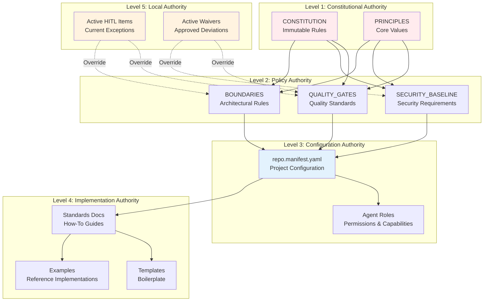
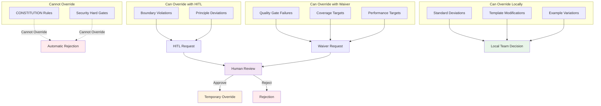
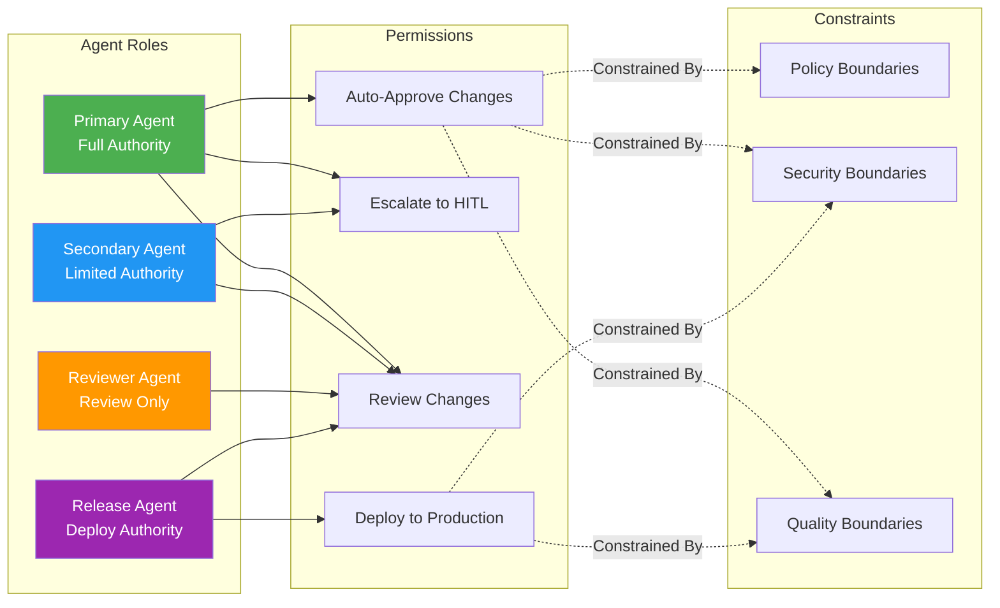
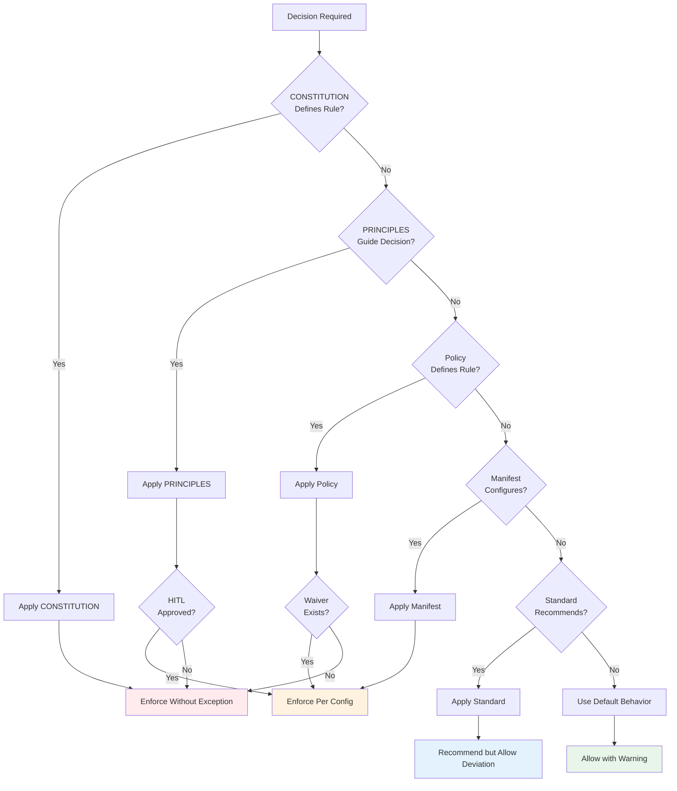
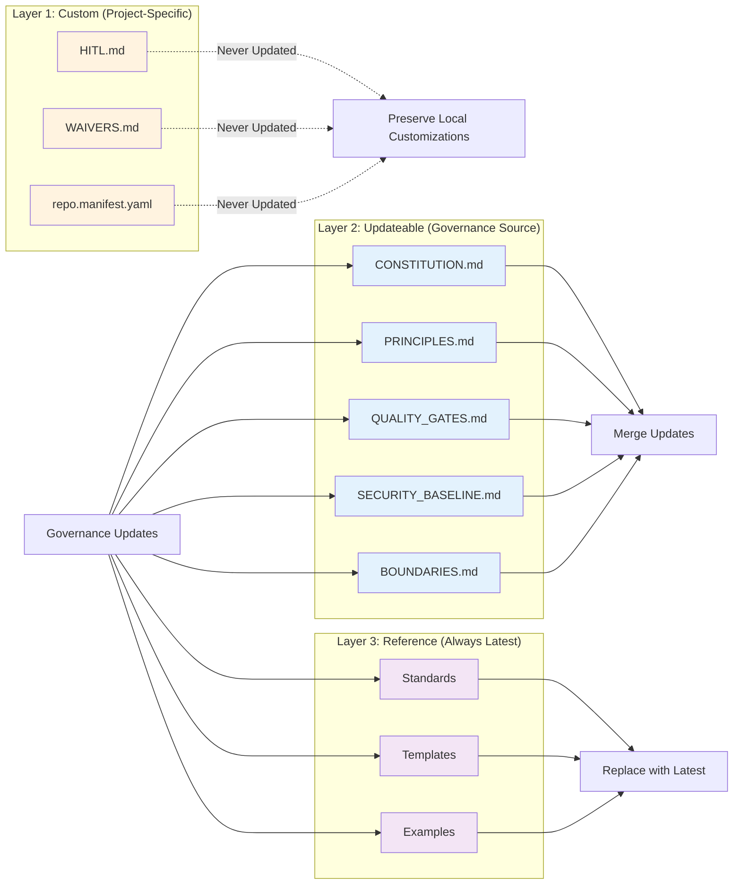

# Authority Chain Diagram

## Overview

This diagram illustrates the hierarchical authority chain in the governance system, showing how policies, agents, manifests, and standards interact to make governance decisions.

## Authority Hierarchy

## Decision Flow

```mermaid
graph LR
    START[Code Change] --> LOAD_POL[Load Policies]
    LOAD_POL --> LOAD_MAN[Load Manifest]
    LOAD_MAN --> CHECK_CONST{Check CONSTITUTION}
    
    CHECK_CONST -->|Violates| REJECT1[❌ Reject]
    CHECK_CONST -->|Complies| CHECK_PRINC{Check PRINCIPLES}
    
    CHECK_PRINC -->|Violates| CHECK_WAIVER1{Has Waiver?}
    CHECK_PRINC -->|Complies| CHECK_BOUND{Check BOUNDARIES}
    
    CHECK_WAIVER1 -->|Yes| CHECK_BOUND
    CHECK_WAIVER1 -->|No| REJECT2[❌ Reject]
    
    CHECK_BOUND -->|Violates| CHECK_HITL1{Has HITL Approval?}
    CHECK_BOUND -->|Complies| CHECK_QG{Check QUALITY_GATES}
    
    CHECK_HITL1 -->|Yes| CHECK_QG
    CHECK_HITL1 -->|No| ESC_HITL1[Escalate to HITL]
    
    CHECK_QG -->|Violates| CHECK_WAIVER2{Has Waiver?}
    CHECK_QG -->|Complies| CHECK_SEC{Check SECURITY}
    
    CHECK_WAIVER2 -->|Yes| CHECK_SEC
    CHECK_WAIVER2 -->|No| CHECK_HITL2{Can Request Waiver?}
    
    CHECK_HITL2 -->|Yes| ESC_WAIVER[Request Waiver]
    CHECK_HITL2 -->|No| REJECT3[❌ Reject]
    
    CHECK_SEC -->|Violates| ESC_SEC[❌ Security Violation]
    CHECK_SEC -->|Complies| APPROVE[✅ Approve]
    
    ESC_HITL1 -.Human Review.-> HUMAN1[Human Decision]
    ESC_WAIVER -.Human Review.-> HUMAN2[Human Decision]
    
    HUMAN1 -->|Approve| CHECK_QG
    HUMAN1 -->|Reject| REJECT4[❌ Reject]
    
    HUMAN2 -->|Approve| CHECK_SEC
    HUMAN2 -->|Reject| REJECT5[❌ Reject]

    style APPROVE fill:#e8f5e9
    style REJECT1 fill:#ffebee
    style REJECT2 fill:#ffebee
    style REJECT3 fill:#ffebee
    style REJECT4 fill:#ffebee
    style REJECT5 fill:#ffebee
    style ESC_SEC fill:#ffebee
    style HUMAN1 fill:#f3e5f5
    style HUMAN2 fill:#f3e5f5
```

## Policy Override Hierarchy

## Agent Authority Model

## Configuration Precedence

## Layer Update Model

## Key Principles

### Authority Hierarchy
1. **CONSTITUTION** - Highest authority, immutable
2. **PRINCIPLES** - Core values, guide all decisions
3. **Policies** - Enforceable rules (QG, Security, Boundaries)
4. **Configuration** - Project-specific settings (Manifest, Agents)
5. **Standards** - Recommendations and best practices
6. **Local** - Team-specific customizations (HITL, Waivers)

### Override Mechanisms
- **No Override**: CONSTITUTION, Security hard gates
- **HITL Override**: Boundaries, Principles
- **Waiver Override**: Quality gates, Performance targets
- **Local Override**: Standards, Templates

### Decision Making
1. Check CONSTITUTION (cannot violate)
2. Check PRINCIPLES (can deviate with HITL)
3. Check Policies (can waive specific rules)
4. Check Manifest (project configuration)
5. Check Standards (recommendations)
6. Default behavior (allow with warning)

### Update Strategy
- **Layer 1 (Custom)**: Never updated automatically
- **Layer 2 (Updateable)**: Merged with care, preserve local changes
- **Layer 3 (Reference)**: Always replaced with latest

## Related Documentation

- **Policy Reference**: `/docs/reference/POLICY_REFERENCE.md`
- **Manifest Reference**: `/docs/reference/MANIFEST_REFERENCE.md`
- **Agent Architecture**: `/docs/architecture/AGENT_ARCHITECTURE.md`
- **Waiver Management**: `/docs/guides/HOW_TO_MANAGE_WAIVERS.md`

---

**Last Updated:** 2026-01-22  
**Version:** 1.0.0
