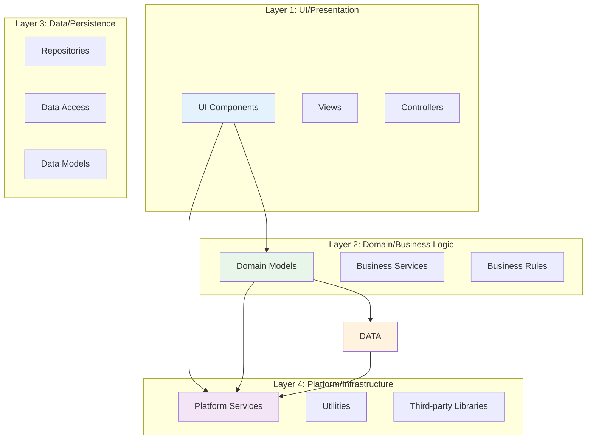
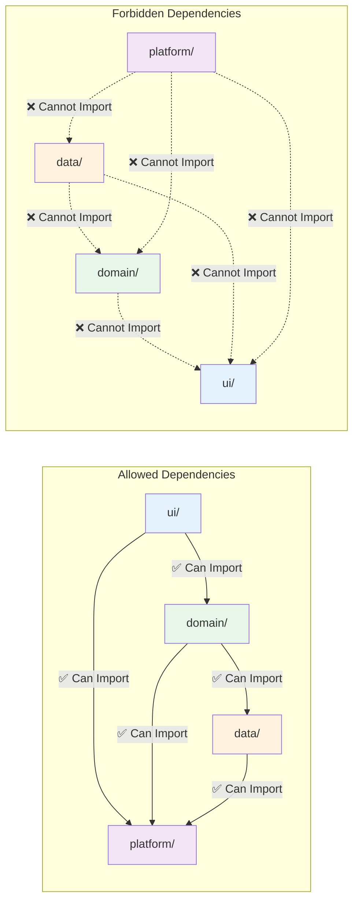
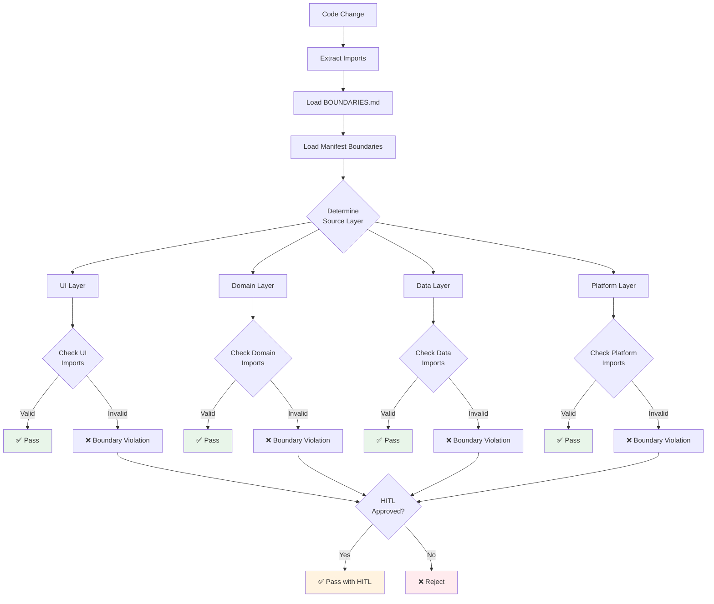
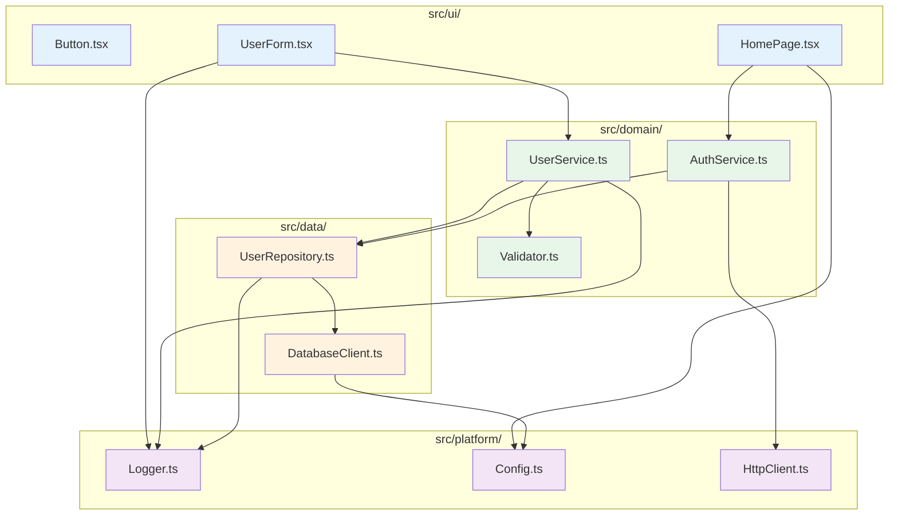
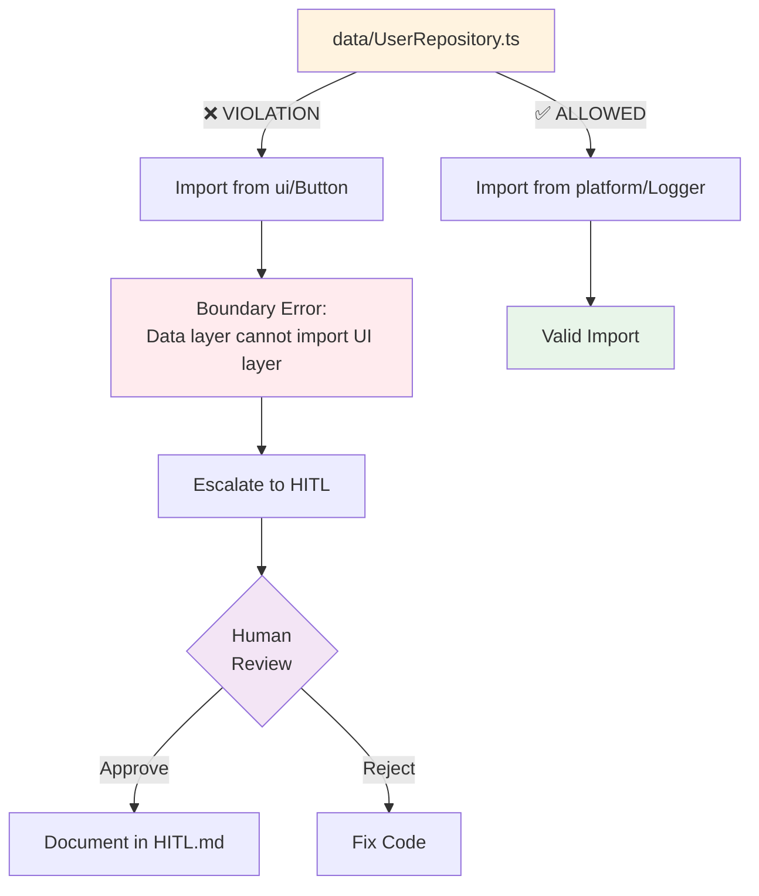
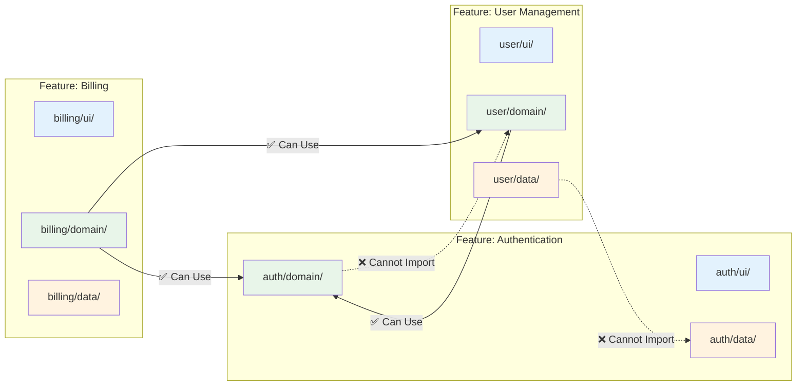
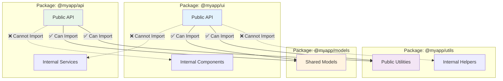
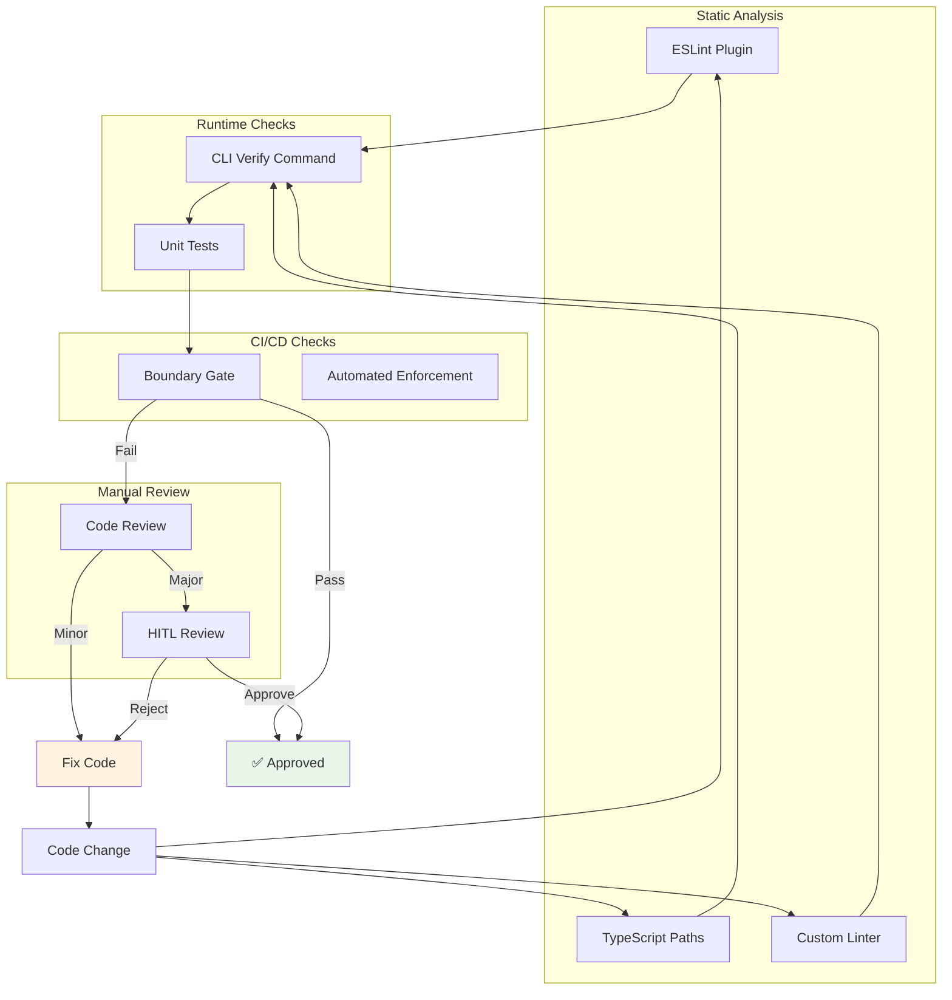

# Boundary Model Diagram

## Overview

This diagram illustrates the layer architecture and boundary enforcement model used in the governance system. It shows how code is organized into layers, what dependencies are allowed, and how boundaries are enforced.

## Four-Layer Architecture



## Dependency Rules



## Boundary Checking Flow



## Practical Examples

### Example 1: Simple Web App



### Example 2: Boundary Violation



## Cross-Feature Boundaries



## Monorepo Package Boundaries



## Boundary Enforcement Mechanisms



## Configuration in repo.manifest.yaml

```yaml
boundaries:
  layer_model:
    ui:
      can_import:
        - domain
        - platform
      cannot_import:
        - data
    
    domain:
      can_import:
        - data
        - platform
      cannot_import:
        - ui
    
    data:
      can_import:
        - platform
      cannot_import:
        - ui
        - domain
    
    platform:
      can_import: []
      cannot_import:
        - ui
        - domain
        - data
  
  cross_feature:
    auth:
      can_be_imported_by:
        - "*"  # All features can use auth
    
    user:
      can_be_imported_by:
        - billing
        - admin
    
    billing:
      can_be_imported_by: []  # No one imports billing
```

## Boundary Violation Examples

### Violation 1: Upward Import
```typescript
// ❌ BAD: Domain importing from UI
// src/domain/UserService.ts
import { Button } from '../ui/Button';  // VIOLATION!
```

### Violation 2: Cross-Feature Data Access
```typescript
// ❌ BAD: Direct data layer access across features
// src/auth/data/AuthRepository.ts
import { UserData } from '../../user/data/UserRepository';  // VIOLATION!
```

### Violation 3: Platform Importing Business Logic
```typescript
// ❌ BAD: Platform importing domain
// src/platform/Logger.ts
import { UserService } from '../domain/UserService';  // VIOLATION!
```

### Valid Example: Proper Layering
```typescript
// ✅ GOOD: UI importing from domain and platform
// src/ui/UserForm.tsx
import { UserService } from '../domain/UserService';  // OK
import { Logger } from '../platform/Logger';  // OK
```

## Key Principles

### Layer Responsibilities
1. **UI Layer**: User interface, presentation logic
2. **Domain Layer**: Business logic, rules, services
3. **Data Layer**: Persistence, repositories, data access
4. **Platform Layer**: Infrastructure, utilities, third-party integrations

### Dependency Rules
- Dependencies flow **downward only** (UI → Domain → Data → Platform)
- **No upward** dependencies allowed
- **No circular** dependencies allowed
- **Cross-layer** skipping is allowed (e.g., UI → Platform)

### Enforcement
- **Static Analysis**: ESLint, TypeScript, custom linters
- **Runtime Checks**: CLI verify, unit tests
- **CI/CD Gates**: Automated enforcement in pipeline
- **HITL Review**: Human approval for justified violations

### Benefits
- **Maintainability**: Clear separation of concerns
- **Testability**: Easy to mock and test layers independently
- **Scalability**: Add features without affecting others
- **Flexibility**: Change implementations without breaking dependents

## Related Documentation

- **Boundary Policy**: `/.repo/policy/BOUNDARIES.md`
- **Architecture Overview**: `/docs/architecture/ARCHITECTURE_OVERVIEW.md`
- **Layer Model**: `/docs/architecture/LAYER_MODEL.md`
- **How to Define Boundaries**: `/docs/guides/HOW_TO_DEFINE_BOUNDARIES.md`

---

**Last Updated:** 2026-01-22  
**Version:** 1.0.0
