# Deployment Pipeline with Governance

## Overview

The Deployment Pipeline diagram illustrates the complete CI/CD pipeline integrated with governance controls, quality gates, security scans, and compliance checks. This comprehensive pipeline ensures that code progresses through multiple validation stages before reaching production, with appropriate governance oversight at each stage.

The pipeline is designed to provide fast feedback while maintaining high quality and compliance standards. It supports multiple environments (development, staging, production), parallel execution where possible, automated rollback capabilities, and comprehensive evidence collection for audit purposes.

## Complete Deployment Pipeline

```mermaid
graph TB
    Start([Code Commit]) --> Trigger[Pipeline Trigger]
    
    Trigger --> Source[Source Stage]
    
    Source --> S_Checkout[Checkout Code]
    S_Checkout --> S_Validate[Validate Source]
    S_Validate --> S_Result{Source<br/>Valid?}
    
    S_Result -->|No| S_Fail[❌ Source Failed]
    S_Fail --> Notify1[Notify Developer]
    Notify1 --> End1([Pipeline Failed])
    
    S_Result -->|Yes| Build[Build Stage]
    
    Build --> B_Env[Setup Environment]
    B_Env --> B_Deps[Resolve Dependencies]
    B_Deps --> B_Compile[Compile/Package]
    B_Compile --> B_Artifacts[Generate Artifacts]
    B_Artifacts --> B_Result{Build<br/>Success?}
    
    B_Result -->|No| B_Fail[❌ Build Failed]
    B_Fail --> Notify2[Notify Developer]
    Notify2 --> End2([Pipeline Failed])
    
    B_Result -->|Yes| Parallel1{Parallel<br/>Stage 1}
    
    Parallel1 --> Test[Test Stage]
    Parallel1 --> StaticAnalysis[Static Analysis]
    
    Test --> T_Unit[Unit Tests]
    Test --> T_Integration[Integration Tests]
    Test --> T_Contract[Contract Tests]
    
    T_Unit --> T_Aggregate[Aggregate Results]
    T_Integration --> T_Aggregate
    T_Contract --> T_Aggregate
    
    T_Aggregate --> T_Coverage[Calculate Coverage]
    T_Coverage --> T_Result{Tests<br/>Pass?}
    
    T_Result -->|No| T_Fail[❌ Tests Failed]
    T_Fail --> Notify3[Notify Developer]
    Notify3 --> End3([Pipeline Failed])
    
    StaticAnalysis --> SA_Lint[Linting]
    StaticAnalysis --> SA_Format[Format Check]
    StaticAnalysis --> SA_Complexity[Complexity Analysis]
    StaticAnalysis --> SA_Duplication[Duplication Check]
    
    SA_Lint --> SA_Aggregate[Aggregate Results]
    SA_Format --> SA_Aggregate
    SA_Complexity --> SA_Aggregate
    SA_Duplication --> SA_Aggregate
    
    SA_Aggregate --> SA_Result{Static<br/>Analysis<br/>Pass?}
    
    SA_Result -->|No| SA_Fail[❌ Analysis Failed]
    SA_Fail --> Notify4[Notify Developer]
    Notify4 --> End4([Pipeline Failed])
    
    T_Result -->|Yes| QualityGate1
    SA_Result -->|Yes| QualityGate1[Quality Gate 1]
    
    QualityGate1 --> QG1_Coverage{Coverage<br/>>= 80%?}
    QualityGate1 --> QG1_Quality{Quality<br/>Score OK?}
    
    QG1_Coverage -->|No| QG1_Fail[❌ Gate 1 Failed]
    QG1_Quality -->|No| QG1_Fail
    QG1_Fail --> Notify5[Notify Developer]
    Notify5 --> End5([Pipeline Failed])
    
    QG1_Coverage -->|Yes| Governance
    QG1_Quality -->|Yes| Governance
    
    Governance[Governance Stage] --> G_Boundary[Boundary Check]
    Governance --> G_Policy[Policy Compliance]
    Governance --> G_Standards[Standards Check]
    
    G_Boundary --> G_Aggregate[Aggregate Results]
    G_Policy --> G_Aggregate
    G_Standards --> G_Aggregate
    
    G_Aggregate --> G_Result{Governance<br/>Pass?}
    
    G_Result -->|Blocker| G_Escalate[HITL Escalation]
    G_Escalate --> G_Human{Human<br/>Decision}
    G_Human -->|Waiver| G_Waiver[Create Waiver]
    G_Waiver --> Security
    G_Human -->|Reject| G_Fail[❌ Governance Failed]
    G_Fail --> Notify6[Notify Developer]
    Notify6 --> End6([Pipeline Failed])
    
    G_Result -->|Warning| G_Warn[Log Warning]
    G_Warn --> Security
    
    G_Result -->|Pass| Security[Security Stage]
    
    Security --> Parallel2{Parallel<br/>Stage 2}
    
    Parallel2 --> Sec_SAST[SAST]
    Parallel2 --> Sec_Deps[Dependency Scan]
    Parallel2 --> Sec_Secrets[Secret Scan]
    Parallel2 --> Sec_Container[Container Scan]
    
    Sec_SAST --> Sec_Aggregate[Aggregate Results]
    Sec_Deps --> Sec_Aggregate
    Sec_Secrets --> Sec_Aggregate
    Sec_Container --> Sec_Aggregate
    
    Sec_Aggregate --> Sec_Result{Security<br/>Issues?}
    
    Sec_Result -->|Critical| Sec_Block[🛑 Block Pipeline]
    Sec_Block --> Sec_Escalate[HITL: Critical Security]
    Sec_Escalate --> Sec_Human{Security<br/>Review}
    Sec_Human -->|Fix| Notify7[Notify Developer]
    Notify7 --> End7([Pipeline Failed])
    Sec_Human -->|Waiver| Sec_Waiver[Security Waiver]
    Sec_Waiver --> QualityGate2
    
    Sec_Result -->|High| Sec_Review[Security Review Required]
    Sec_Review --> Sec_Reviewer{Reviewer<br/>Decision}
    Sec_Reviewer -->|Approve| QualityGate2
    Sec_Reviewer -->|Reject| Notify7
    
    Sec_Result -->|Low/None| QualityGate2[Quality Gate 2]
    
    QualityGate2 --> QG2_Tests{All Tests<br/>Pass?}
    QualityGate2 --> QG2_Security{Security<br/>Clean?}
    QualityGate2 --> QG2_Governance{Governance<br/>OK?}
    
    QG2_Tests -->|No| QG2_Fail[❌ Gate 2 Failed]
    QG2_Security -->|No| QG2_Fail
    QG2_Governance -->|No| QG2_Fail
    QG2_Fail --> Notify8[Notify Developer]
    Notify8 --> End8([Pipeline Failed])
    
    QG2_Tests -->|Yes| Deploy_Dev
    QG2_Security -->|Yes| Deploy_Dev
    QG2_Governance -->|Yes| Deploy_Dev
    
    Deploy_Dev[Deploy to Dev] --> Dev_Deploy[Execute Deployment]
    Dev_Deploy --> Dev_Smoke[Smoke Tests]
    Dev_Smoke --> Dev_Result{Dev<br/>Healthy?}
    
    Dev_Result -->|No| Dev_Rollback[Rollback Dev]
    Dev_Rollback --> Notify9[Notify Team]
    Notify9 --> End9([Pipeline Failed])
    
    Dev_Result -->|Yes| Dev_E2E[E2E Tests]
    Dev_E2E --> Dev_E2E_Result{E2E<br/>Pass?}
    
    Dev_E2E_Result -->|No| Dev_Rollback
    Dev_E2E_Result -->|Yes| QualityGate3[Quality Gate 3]
    
    QualityGate3 --> QG3_Dev{Dev<br/>Validated?}
    QG3_Dev -->|No| QG3_Fail[❌ Gate 3 Failed]
    QG3_Fail --> Notify10[Notify Team]
    Notify10 --> End10([Pipeline Failed])
    
    QG3_Dev -->|Yes| Approval_Staging{Staging<br/>Approval}
    
    Approval_Staging -->|Auto| Deploy_Staging
    Approval_Staging -->|Manual| Staging_Human{Human<br/>Approval}
    Staging_Human -->|Reject| End11([Pipeline Stopped])
    Staging_Human -->|Approve| Deploy_Staging
    
    Deploy_Staging[Deploy to Staging] --> Stg_Deploy[Execute Deployment]
    Stg_Deploy --> Stg_Smoke[Smoke Tests]
    Stg_Smoke --> Stg_Result{Staging<br/>Healthy?}
    
    Stg_Result -->|No| Stg_Rollback[Rollback Staging]
    Stg_Rollback --> Notify11[Notify Team]
    Notify11 --> End12([Pipeline Failed])
    
    Stg_Result -->|Yes| Stg_Full[Full Test Suite]
    Stg_Full --> Stg_Perf[Performance Tests]
    Stg_Perf --> Stg_Security[Security Tests]
    Stg_Security --> Stg_Test_Result{All Tests<br/>Pass?}
    
    Stg_Test_Result -->|No| Stg_Rollback
    Stg_Test_Result -->|Yes| QualityGate4[Quality Gate 4]
    
    QualityGate4 --> QG4_Staging{Staging<br/>Validated?}
    QG4_Staging -->|No| QG4_Fail[❌ Gate 4 Failed]
    QG4_Fail --> Notify12[Notify Team]
    Notify12 --> End13([Pipeline Failed])
    
    QG4_Staging -->|Yes| Evidence[Generate Evidence Package]
    
    Evidence --> Ev_Build[Build Evidence]
    Evidence --> Ev_Test[Test Evidence]
    Evidence --> Ev_Security[Security Evidence]
    Evidence --> Ev_Governance[Governance Evidence]
    Evidence --> Ev_Deployment[Deployment Evidence]
    
    Ev_Build --> Ev_Package[Package Evidence]
    Ev_Test --> Ev_Package
    Ev_Security --> Ev_Package
    Ev_Governance --> Ev_Package
    Ev_Deployment --> Ev_Package
    
    Ev_Package --> Approval_Prod{Production<br/>Approval}
    
    Approval_Prod --> Prod_Auto{Auto-<br/>Approve?}
    
    Prod_Auto -->|Yes| Prod_AutoApprove[Automated Approval]
    Prod_AutoApprove --> Deploy_Prod
    
    Prod_Auto -->|No| Prod_Manual[Manual Approval Required]
    Prod_Manual --> Prod_Reviewer{Reviewer<br/>Decision}
    Prod_Reviewer -->|Reject| End14([Pipeline Stopped])
    Prod_Reviewer -->|Approve| Deploy_Prod
    
    Deploy_Prod[Deploy to Production] --> Prod_Strategy{Deployment<br/>Strategy}
    
    Prod_Strategy -->|Blue/Green| Prod_BlueGreen[Blue/Green Deploy]
    Prod_Strategy -->|Canary| Prod_Canary[Canary Deploy]
    Prod_Strategy -->|Rolling| Prod_Rolling[Rolling Deploy]
    
    Prod_BlueGreen --> Prod_NewEnv[Deploy to Green]
    Prod_NewEnv --> Prod_BG_Test[Test Green]
    Prod_BG_Test --> Prod_BG_Result{Green<br/>Healthy?}
    Prod_BG_Result -->|No| Prod_BG_Rollback[Keep Blue Active]
    Prod_BG_Rollback --> Notify13[Notify Ops]
    Notify13 --> End15([Deploy Failed])
    Prod_BG_Result -->|Yes| Prod_BG_Switch[Switch Traffic]
    Prod_BG_Switch --> Prod_Monitor
    
    Prod_Canary --> Prod_C_Initial[Deploy to 10%]
    Prod_C_Initial --> Prod_C_Monitor1[Monitor 10%]
    Prod_C_Monitor1 --> Prod_C_Result1{Healthy?}
    Prod_C_Result1 -->|No| Prod_C_Rollback[Rollback Canary]
    Prod_C_Rollback --> Notify14[Notify Ops]
    Notify14 --> End16([Deploy Failed])
    Prod_C_Result1 -->|Yes| Prod_C_50[Scale to 50%]
    Prod_C_50 --> Prod_C_Monitor2[Monitor 50%]
    Prod_C_Monitor2 --> Prod_C_Result2{Healthy?}
    Prod_C_Result2 -->|No| Prod_C_Rollback
    Prod_C_Result2 -->|Yes| Prod_C_100[Scale to 100%]
    Prod_C_100 --> Prod_Monitor
    
    Prod_Rolling --> Prod_R_Batch[Deploy Batch 1]
    Prod_R_Batch --> Prod_R_Monitor[Monitor Batch]
    Prod_R_Monitor --> Prod_R_Result{Batch<br/>Healthy?}
    Prod_R_Result -->|No| Prod_R_Rollback[Rollback Batch]
    Prod_R_Rollback --> Notify15[Notify Ops]
    Notify15 --> End17([Deploy Failed])
    Prod_R_Result -->|Yes| Prod_R_More{More<br/>Batches?}
    Prod_R_More -->|Yes| Prod_R_Batch
    Prod_R_More -->|No| Prod_Monitor
    
    Prod_Monitor[Production Monitoring] --> PM_Metrics[Collect Metrics]
    PM_Metrics --> PM_Errors[Monitor Errors]
    PM_Errors --> PM_Performance[Monitor Performance]
    PM_Performance --> PM_Result{Production<br/>Healthy?}
    
    PM_Result -->|Issues| PM_Alert[Alert Ops Team]
    PM_Alert --> PM_Decision{Auto-<br/>Rollback?}
    PM_Decision -->|Yes| PM_AutoRollback[Automatic Rollback]
    PM_AutoRollback --> PM_Investigate[Investigate Issue]
    PM_Investigate --> End18([Deploy Rolled Back])
    PM_Decision -->|No| PM_Manual[Manual Investigation]
    PM_Manual --> PM_ManualDecision{Rollback<br/>Needed?}
    PM_ManualDecision -->|Yes| PM_ManualRollback[Manual Rollback]
    PM_ManualRollback --> End18
    PM_ManualDecision -->|No| PM_Fix[Apply Fix]
    PM_Fix --> PM_Metrics
    
    PM_Result -->|Healthy| Success[✓ Deployment Successful]
    
    Success --> Post[Post-Deployment]
    Post --> Post_Notify[Notify Stakeholders]
    Post --> Post_Archive[Archive Evidence]
    Post --> Post_Metrics[Update Metrics]
    Post --> Post_Docs[Update Documentation]
    
    Post_Notify --> Complete([Pipeline Complete])
    Post_Archive --> Complete
    Post_Metrics --> Complete
    Post_Docs --> Complete
    
    style Start fill:#e3f2fd
    style Success fill:#4caf50,color:#fff
    style Complete fill:#4caf50,color:#fff
    style S_Fail fill:#f44336,color:#fff
    style B_Fail fill:#f44336,color:#fff
    style T_Fail fill:#f44336,color:#fff
    style SA_Fail fill:#f44336,color:#fff
    style QG1_Fail fill:#f44336,color:#fff
    style G_Fail fill:#f44336,color:#fff
    style Sec_Block fill:#f44336,color:#fff
    style QG2_Fail fill:#f44336,color:#fff
    style QG3_Fail fill:#f44336,color:#fff
    style QG4_Fail fill:#f44336,color:#fff
    style G_Escalate fill:#ff5722
    style Sec_Escalate fill:#ff5722
    style Sec_Review fill:#ff9800
```



## Pipeline Stages Detail


## Quality Gates Configuration


## Deployment Strategies


## Rollback Mechanisms


## Multi-Environment Configuration

```mermaid
graph LR
    subgraph "Development"
        Dev_Config[Dev Config]
        Dev_Config --> Dev_Props[• Auto-deploy<br/>• Relaxed gates<br/>• Debug enabled<br/>• Mock services]
    end
    
    subgraph "Staging"
        Stg_Config[Staging Config]
        Stg_Config --> Stg_Props[• Auto-deploy<br/>• Full gates<br/>• Production-like<br/>• Real services]
    end
    
    subgraph "Production"
        Prod_Config[Prod Config]
        Prod_Config --> Prod_Props[• Manual approval<br/>• Strict gates<br/>• High availability<br/>• Full monitoring]
    end
    
    Dev_Props ==>|Promote| Stg_Props
    Stg_Props ==>|Promote| Prod_Props
    
    subgraph "Environment Parity"
        Parity[Maximize Similarity]
        Parity --> P1[Same OS/Runtime]
        Parity --> P2[Same Dependencies]
        Parity --> P3[Same Configuration Structure]
        Parity --> P4[Same Security Controls]
    end
    
    Dev_Props -.->|Align With| Parity
    Stg_Props -.->|Align With| Parity
    Prod_Props -.->|Align With| Parity
```



## Key Principles

### 1. Shift-Left Testing
Testing and validation occur as early as possible in the pipeline. Fast feedback on build and test failures prevents wasted time on later stages.

### 2. Parallel Execution
Independent stages run in parallel when possible (tests + static analysis, multiple security scans) to minimize total pipeline time.

### 3. Progressive Validation
Each stage adds more sophisticated validation. Simple checks first, expensive checks later, production deployment last.

### 4. Quality Gates
Explicit quality gates between major stages ensure that only high-quality code progresses. Failed gates stop the pipeline immediately.

### 5. Defense in Depth
Multiple layers of validation (tests, security, governance, deployment validation) provide comprehensive protection.

### 6. Safe Deployment
Progressive rollout strategies (blue/green, canary, rolling) with automatic rollback capabilities minimize production risk.

## Practical Examples

### Example 1: Simple Microservice Deploy

```
Service: User API
Pipeline Duration: ~12 minutes
Strategy: Blue/Green

Timeline:
00:00 - Code commit pushed
00:01 - Pipeline triggered
00:02 - Build complete (2 min)
00:04 - Tests complete (2 min, parallel)
00:04 - Static analysis complete (2 min, parallel)
00:05 - Quality Gate 1: PASS
00:06 - Governance checks: PASS
00:07 - Security scans: PASS (parallel)
00:08 - Quality Gate 2: PASS
00:09 - Deploy to Dev: Success
00:09 - Smoke tests: PASS
00:10 - Quality Gate 3: PASS
00:10 - Deploy to Staging: Success
00:11 - Full test suite: PASS
00:11 - Quality Gate 4: PASS
00:12 - Production approval: AUTO (trusted service)
00:13 - Blue/Green deploy start
00:14 - Green environment healthy
00:14 - Traffic switched to Green
00:15 - Monitoring: Healthy
00:15 - Pipeline complete

Result: Successful deployment, zero downtime
Human involvement: None (fully automated)
```

### Example 2: Complex Application with Manual Gates

```
Service: Payment Processing
Pipeline Duration: ~45 minutes + approvals
Strategy: Canary

Timeline:
00:00 - Code commit pushed
00:02 - Build complete (2 min)
00:07 - Tests complete (5 min - extensive test suite)
00:07 - Static analysis complete (5 min, parallel)
00:08 - Quality Gate 1: PASS
00:09 - Governance checks: WARNING (minor policy deviation)
00:10 - Security scans: HIGH severity found
00:11 - HITL Escalation: Security review required
02:00 - Security team reviews (human delay)
02:15 - Security team: Approves with waiver
02:16 - Quality Gate 2: PASS (with waiver)
02:17 - Deploy to Dev: Success
02:18 - E2E tests: PASS (extensive payment flows)
02:20 - Quality Gate 3: PASS
02:21 - Deploy to Staging: Success
02:30 - Full test suite + Performance: PASS
02:31 - Quality Gate 4: PASS
02:32 - Production approval required (manual)
04:00 - Engineering manager approves (human delay)
04:01 - Canary deploy: 10%
04:06 - Monitor 10%: Healthy (5 min soak time)
04:07 - Canary scale: 50%
04:17 - Monitor 50%: Healthy (10 min soak time)
04:18 - Canary scale: 100%
04:33 - Monitor 100%: Healthy (15 min soak time)
04:34 - Pipeline complete

Result: Successful deployment, progressive rollout
Human involvement: Security review + production approval
Total time: 4 hours 34 minutes (mostly human review + soak times)
```

### Example 3: Failed Deployment with Rollback

```
Service: Frontend Application
Pipeline Duration: ~18 minutes (failed)
Strategy: Rolling Update

Timeline:
00:00 - Code commit pushed
00:02 - Build complete
00:05 - Tests complete: PASS
00:06 - Quality Gates 1 & 2: PASS
00:07 - Deploy to Dev: Success
00:08 - Deploy to Staging: Success
00:10 - Full tests: PASS
00:11 - Quality Gate 4: PASS
00:12 - Production approval: AUTO
00:13 - Rolling update start
00:14 - Pod 1 updated: Healthy
00:15 - Pod 2 updated: Healthy
00:16 - Pod 3 updated: ERROR RATE SPIKE
00:16 - Automatic rollback triggered
00:17 - All pods reverted to previous version
00:18 - Health restored, rollback complete
00:18 - Pipeline failed, team notified

Result: Deployment failed, automatic rollback successful
Issue: New code caused errors under production load
Impact: Minimal (caught after 2 pods, quickly rolled back)
Human involvement: Post-incident investigation
```

## Success Metrics

### Pipeline Performance
- **Total Duration**: Target < 15 minutes for standard services
- **Success Rate**: Target > 95% pass rate
- **Stage Duration**: Breakdown by stage
- **Parallel Efficiency**: Time saved by parallel execution

### Quality Metrics
- **Test Coverage**: Target >= 80%
- **Test Pass Rate**: Target >= 95%
- **Security Issue Rate**: Issues found per build
- **Governance Compliance**: Compliance rate by stage

### Deployment Metrics
- **Deployment Frequency**: Deploys per day/week
- **Lead Time**: Commit to production time
- **Change Failure Rate**: Percentage requiring rollback
- **Mean Time to Recovery**: Time to rollback if needed

### Business Impact
- **Downtime**: Target zero downtime
- **Incident Rate**: Production issues per deployment
- **Time to Market**: Feature delivery speed
- **Developer Productivity**: Pipeline wait time

## Optimization Techniques

### Caching Strategies
- **Dependency caching**: Cache node_modules, Maven dependencies
- **Docker layer caching**: Reuse unchanged layers
- **Build artifact caching**: Reuse compilation outputs
- **Test result caching**: Skip unchanged tests

### Parallel Execution
- **Test splitting**: Distribute tests across runners
- **Matrix builds**: Test multiple configurations simultaneously
- **Concurrent stages**: Run independent stages in parallel
- **Fan-out/fan-in**: Parallel deployment to multiple regions

### Smart Triggers
- **Path-based triggers**: Only run affected pipelines
- **Conditional stages**: Skip unnecessary stages
- **Fast-path for simple changes**: Abbreviated pipeline for docs
- **Priority queues**: Critical fixes jump the queue

## Related Documentation

- [PR Workflow](./pr-workflow.md) - Pull request integration
- [Agent Execution Flow](./agent-execution-flow.md) - Agent-driven deployments
- [Security Architecture](./security-architecture.md) - Security scanning integration
- [System Architecture](./system-architecture.md) - Overall system design
- `docs/guides/pipeline-configuration.md` - Pipeline setup guide
- `docs/guides/deployment-strategies.md` - Deployment strategy selection
- `docs/guides/rollback-procedures.md` - Rollback playbooks

---

**Last Updated:** 2026-01-22  
**Version:** 1.0.0
