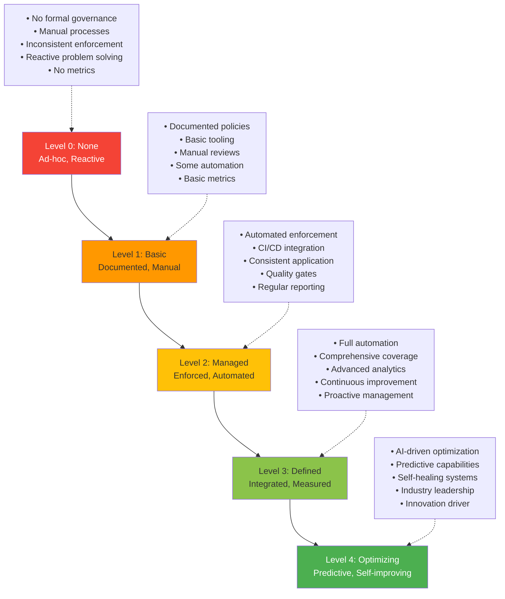
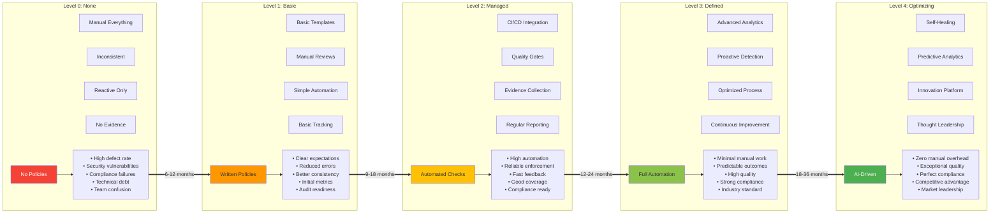
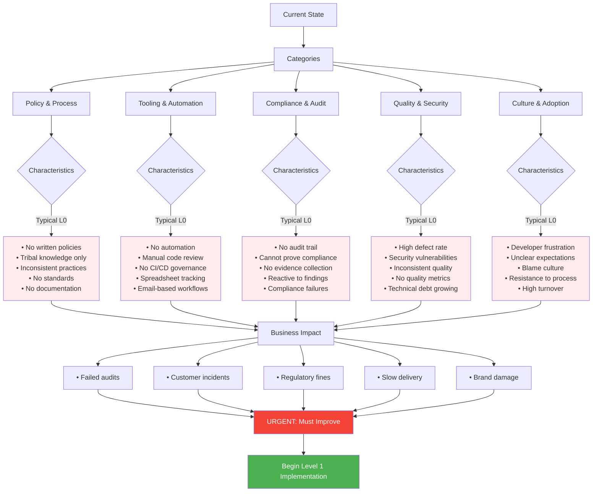
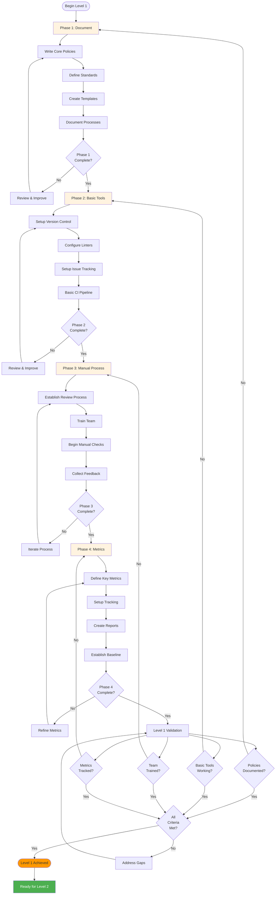
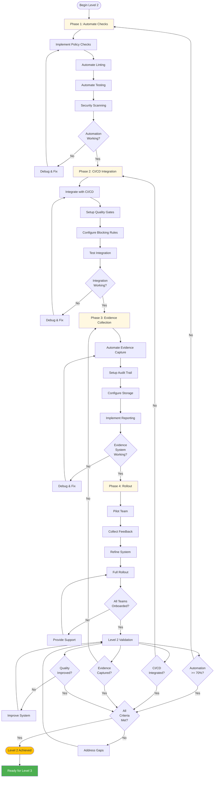
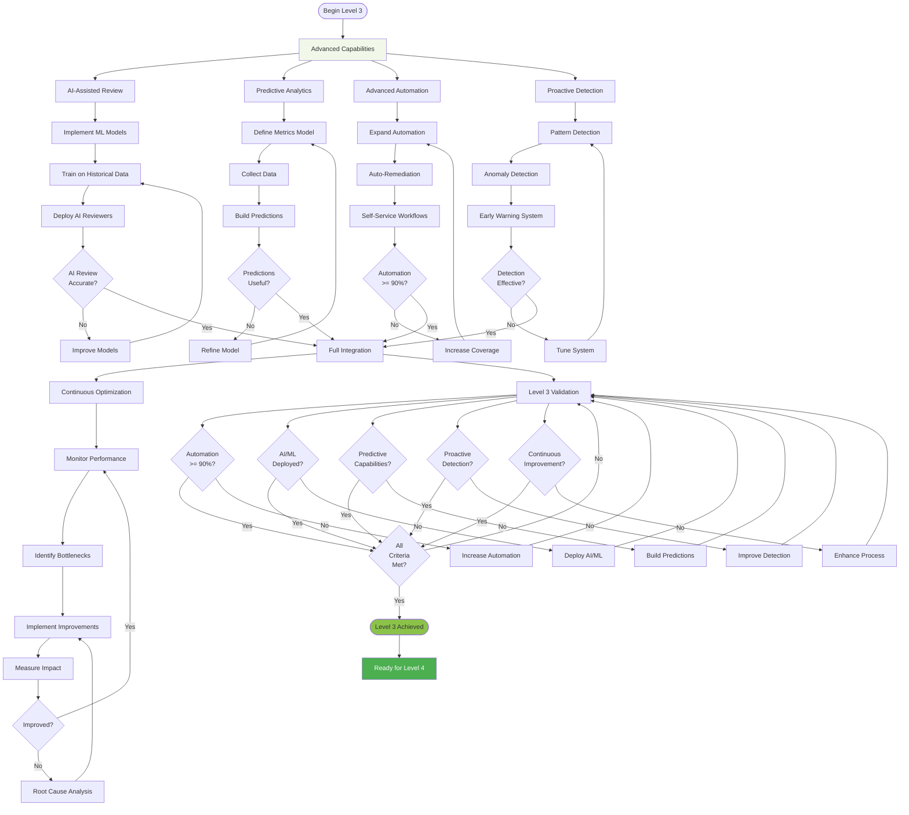
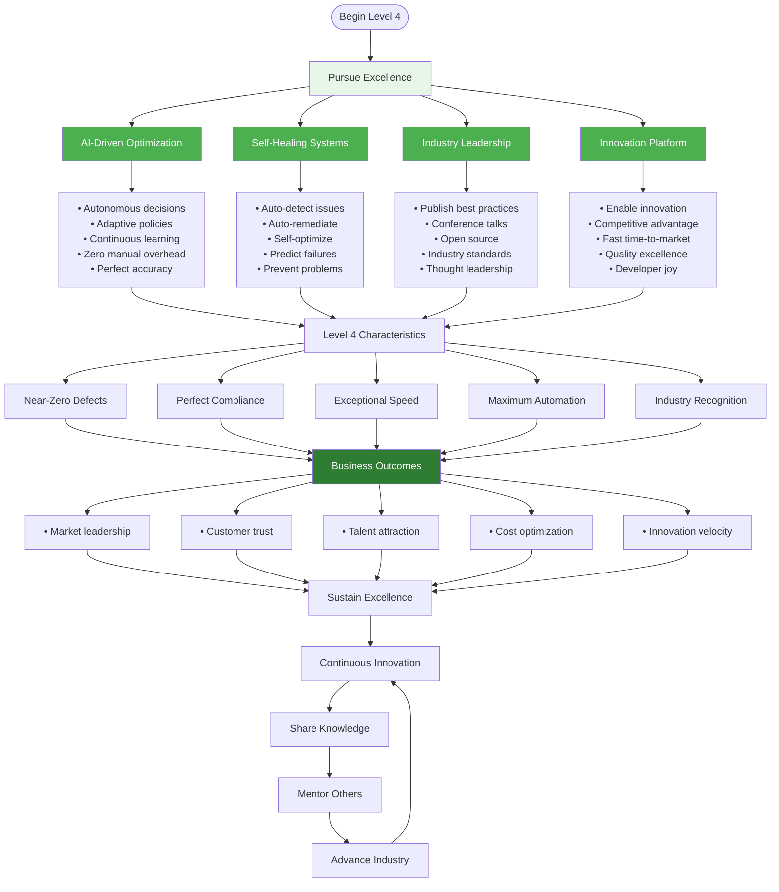
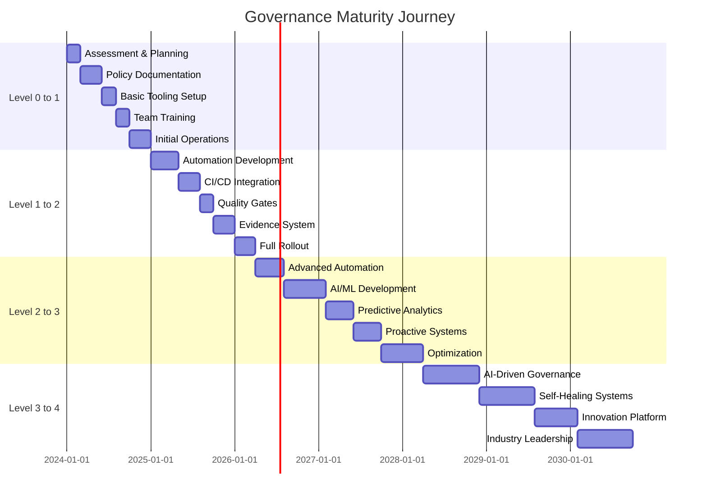

# Governance Maturity Model

## Overview

The Governance Maturity Model diagram illustrates the five-level progression path from no governance (Level 0) to optimized, self-improving governance (Level 4). This model helps organizations assess their current state, plan their governance journey, and measure progress toward governance excellence.

Each maturity level represents a significant milestone in governance capability, with well-defined characteristics, required capabilities, success metrics, and estimated timelines. Organizations typically progress through these levels sequentially, building on the foundation of each previous level.

## Maturity Level Overview



## Detailed Maturity Progression



## Level 0: None - Current State Assessment



## Level 1: Basic - Foundation Building



## Level 2: Managed - Automation & Enforcement



## Level 3: Defined - Advanced Capabilities



## Level 4: Optimizing - Excellence & Innovation



## Capability Comparison Matrix

```mermaid
graph TB
    subgraph "Policy Management"
        PM0[L0: None] --> PM1[L1: Documented]
        PM1 --> PM2[L2: Enforced]
        PM2 --> PM3[L3: Optimized]
        PM3 --> PM4[L4: Adaptive]
    end
    
    subgraph "Automation Level"
        A0[L0: 0%] --> A1[L1: 20-40%]
        A1 --> A2[L2: 70-85%]
        A2 --> A3[L3: 90-95%]
        A3 --> A4[L4: 95-100%]
    end
    
    subgraph "Quality Outcomes"
        Q0[L0: Variable] --> Q1[L1: Improving]
        Q1 --> Q2[L2: Good]
        Q2 --> Q3[L3: Excellent]
        Q3 --> Q4[L4: Exceptional]
    end
    
    subgraph "Compliance Posture"
        C0[L0: Failing] --> C1[L1: Basic]
        C1 --> C2[L2: Compliant]
        C2 --> C3[L3: Exemplary]
        C3 --> C4[L4: Industry Leader]
    end
    
    subgraph "Time to Market"
        T0[L0: Slow] --> T1[L1: Moderate]
        T1 --> T2[L2: Fast]
        T2 --> T3[L3: Very Fast]
        T3 --> T4[L4: Optimal]
    end
    
    style PM0 fill:#f44336,color:#fff
    style A0 fill:#f44336,color:#fff
    style Q0 fill:#f44336,color:#fff
    style C0 fill:#f44336,color:#fff
    style T0 fill:#f44336,color:#fff
    
    style PM1 fill:#ff9800
    style A1 fill:#ff9800
    style Q1 fill:#ff9800
    style C1 fill:#ff9800
    style T1 fill:#ff9800
    
    style PM2 fill:#ffc107
    style A2 fill:#ffc107
    style Q2 fill:#ffc107
    style C2 fill:#ffc107
    style T2 fill:#ffc107
    
    style PM3 fill:#8bc34a
    style A3 fill:#8bc34a
    style Q3 fill:#8bc34a
    style C3 fill:#8bc34a
    style T3 fill:#8bc34a
    
    style PM4 fill:#4caf50,color:#fff
    style A4 fill:#4caf50,color:#fff
    style Q4 fill:#4caf50,color:#fff
    style C4 fill:#4caf50,color:#fff
    style T4 fill:#4caf50,color:#fff
```



## Timeline and Investment Requirements



## Key Principles

### 1. Sequential Progression
Organizations must build capability progressively. Each level provides the foundation for the next. Attempting to skip levels typically results in failure.

### 2. Investment Requirements
Each level requires increasing investment in tooling, automation, and expertise. Budget appropriately for multi-year journey.

### 3. Cultural Transformation
Technical capabilities alone are insufficient. Culture, training, and adoption are equally important for success.

### 4. Continuous Improvement
Even at Level 4, there is no "done." Continuous improvement and adaptation are required to maintain excellence.

### 5. Business Alignment
Governance maturity should align with business needs. Not all organizations need Level 4; many find Level 2 or 3 sufficient.

### 6. Measured Progress
Define success metrics at each level. Use data to validate progression and demonstrate value.

## Practical Examples

### Example 1: Startup Progression (0→1→2)

```
Company: Fast-growing SaaS startup, 25 developers

Year 1 (Level 0):
- No formal governance
- Fast moving, breaking things
- Security incident triggers need for governance
- Failed customer audit

Months 0-6 (Level 0 → 1):
- Hired governance lead
- Documented core policies (security, quality, compliance)
- Setup basic PR review process
- Implemented mandatory code review
- Started tracking basic metrics
- Investment: 1 FTE, $50K tooling
- Result: Passed next audit, team alignment improved

Months 7-15 (Level 1 → 2):
- Implemented automated security scanning
- Integrated governance into CI/CD
- Setup quality gates (coverage, complexity)
- Automated evidence collection
- Rolled out to all teams
- Investment: 2 FTE, $150K tooling
- Result: 75% automation, compliance ready, faster delivery

Year 2+ (Level 2):
- Maintaining Level 2
- Continuous improvement
- Not pursuing Level 3 (not needed for business stage)
- Investment: 1.5 FTE, $100K/year
- Result: Stable, compliant, fast

Outcome: Appropriate maturity for business stage
```

### Example 2: Enterprise Progression (1→2→3)

```
Company: Financial services firm, 500 developers

Starting Point (Level 1):
- Basic policies in place
- Manual review processes
- Some automation
- Struggling to scale

Year 1 (Level 1 → 2):
- Built automation platform
- Integrated with enterprise CI/CD
- Deployed quality gates across all teams
- Evidence system for compliance
- Investment: 10 FTE, $1M tooling
- Result: 80% automation, reliable compliance

Years 2-3 (Level 2 → 3):
- Developed AI-assisted code review
- Predictive quality analytics
- Proactive security detection
- Self-service governance workflows
- Investment: 15 FTE, $2M tooling + cloud
- Result: 92% automation, industry-leading quality

Year 4+ (Level 3 → 4):
- Currently in progress
- Building self-healing capabilities
- Developing industry thought leadership
- Contributing to open source
- Investment: 20 FTE, $3M/year
- Target: Market differentiation

Outcome: Governance as competitive advantage
```

### Example 3: Government Agency (0→1 focus)

```
Organization: Federal agency, 200 IT staff

Starting Point (Level 0):
- No governance framework
- Compliance failures
- Audit findings accumulating
- Congressional scrutiny

Year 1-2 (Level 0 → 1):
- Engaged consulting firm
- Documented comprehensive policies
- Established governance office
- Trained all staff
- Setup manual review boards
- Basic metrics and reporting
- Investment: $5M consulting, 5 FTE
- Result: Passed audit, cleared findings

Year 3 (Operating at Level 1):
- Manual processes working
- Good compliance posture
- Not pursuing Level 2 (budget constraints)
- Focus on sustainability
- Investment: 5 FTE, $500K/year
- Result: Maintaining compliance

Future:
- May pursue Level 2 when budget available
- For now, Level 1 meets requirements

Outcome: Appropriate for resources and requirements
```

## Success Metrics by Level

### Level 0 Metrics (Baseline)
- **Defect Rate**: 50-100 per 1000 lines
- **Security Incidents**: Frequent
- **Compliance**: Failing audits
- **Time to Production**: Weeks to months
- **Developer Satisfaction**: Low

### Level 1 Metrics (Basic)
- **Defect Rate**: 20-50 per 1000 lines
- **Security Incidents**: Reduced
- **Compliance**: Passing with findings
- **Time to Production**: 1-2 weeks
- **Developer Satisfaction**: Moderate
- **Process Adherence**: 60-70%
- **Documentation Coverage**: 80%+

### Level 2 Metrics (Managed)
- **Defect Rate**: 5-20 per 1000 lines
- **Security Incidents**: Rare
- **Compliance**: Consistent passing
- **Time to Production**: 2-5 days
- **Developer Satisfaction**: Good
- **Automation Rate**: 70-85%
- **Quality Gate Pass Rate**: 85%+
- **Evidence Completeness**: 95%+

### Level 3 Metrics (Defined)
- **Defect Rate**: 1-5 per 1000 lines
- **Security Incidents**: Very rare
- **Compliance**: Exemplary
- **Time to Production**: 1-2 days
- **Developer Satisfaction**: High
- **Automation Rate**: 90-95%
- **Predictive Accuracy**: 80%+
- **Proactive Detection**: 70%+

### Level 4 Metrics (Optimizing)
- **Defect Rate**: < 1 per 1000 lines
- **Security Incidents**: Near zero
- **Compliance**: Industry leader
- **Time to Production**: Hours
- **Developer Satisfaction**: Exceptional
- **Automation Rate**: 95-100%
- **Self-Healing Success**: 90%+
- **Innovation Rate**: High

## Assessment Questionnaire

### Use this to assess your current level:

**Policy & Process (Score 0-4)**
- 0: No documented policies
- 1: Basic policies documented
- 2: Policies enforced automatically
- 3: Policies optimized continuously
- 4: Policies adapt automatically

**Automation (Score 0-4)**
- 0: No automation (0%)
- 1: Basic automation (20-40%)
- 2: High automation (70-85%)
- 3: Very high automation (90-95%)
- 4: Near-complete automation (95-100%)

**Quality Outcomes (Score 0-4)**
- 0: High defect rates, incidents
- 1: Improving quality metrics
- 2: Good quality, few issues
- 3: Excellent quality, rare issues
- 4: Exceptional quality, near-zero defects

**Compliance (Score 0-4)**
- 0: Failing audits
- 1: Passing with findings
- 2: Consistently passing
- 3: Exemplary compliance
- 4: Industry leadership

**Speed (Score 0-4)**
- 0: Weeks to production
- 1: 1-2 weeks to production
- 2: 2-5 days to production
- 3: 1-2 days to production
- 4: Hours to production

**Total Score**:
- 0-5: Level 0
- 6-10: Level 1
- 11-15: Level 2
- 16-19: Level 3
- 20: Level 4

## Related Documentation

- [System Architecture](./system-architecture.md) - Technical implementation supporting each level
- [PR Workflow](./pr-workflow.md) - Workflow automation progression
- [Deployment Pipeline](./deployment-pipeline.md) - CI/CD maturity progression
- [Security Architecture](./security-architecture.md) - Security capability growth
- `docs/guides/maturity-assessment.md` - Detailed assessment guide
- `docs/guides/level-transition-guide.md` - How to progress between levels
- `docs/policies/maturity-requirements.md` - Requirements for each level

---

**Last Updated:** 2026-01-22  
**Version:** 1.0.0
