# Pull Request Workflow

## Overview

The Pull Request (PR) Workflow diagram illustrates the complete lifecycle of a pull request from creation through merge, including all governance checks, quality gates, CI/CD integration, review processes, and approval mechanisms. This workflow ensures that every code change meets quality, security, and compliance standards before being integrated into the main codebase.

The PR workflow is designed to balance automation efficiency with human oversight, providing automated checks for routine validation while requiring human review for critical decisions. It integrates seamlessly with existing CI/CD pipelines and governance frameworks, providing comprehensive evidence generation for audit and compliance purposes.

## Complete PR Workflow


## PR Creation and Initial Validation


## Automated vs Manual Approval Decision


## Quality Gate Stage Details

```mermaid
graph TB
    subgraph "Build Quality Gate"
        B1[Compilation] --> B2{Success?}
        B2 -->|No| B_Fail[❌ Fail]
        B2 -->|Yes| B3[Dependency Resolution]
        B3 --> B4{Success?}
        B4 -->|No| B_Fail
        B4 -->|Yes| B5[Asset Generation]
        B5 --> B6{Success?}
        B6 -->|No| B_Fail
        B6 -->|Yes| B_Pass[✓ Pass]
    end
    
    subgraph "Test Quality Gate"
        T1[Unit Tests] --> T2{Coverage<br/>>= 80%?}
        T2 -->|No| T_Warn[⚠ Warning]
        T2 -->|Yes| T3[Integration Tests]
        T_Warn --> T3
        T3 --> T4{Pass Rate<br/>>= 95%?}
        T4 -->|No| T_Fail[❌ Fail]
        T4 -->|Yes| T5[E2E Tests]
        T5 --> T6{Critical<br/>Paths Pass?}
        T6 -->|No| T_Fail
        T6 -->|Yes| T_Pass[✓ Pass]
    end
    
    subgraph "Security Quality Gate"
        S1[SAST Scan] --> S2{Critical<br/>Issues?}
        S2 -->|Yes| S_Block[🛑 Block]
        S2 -->|No| S3[Dependency Check]
        S3 --> S4{Known<br/>Vulns?}
        S4 -->|Critical| S_Block
        S4 -->|High| S_Review[👤 Human Review]
        S4 -->|Low/None| S5[Secret Scan]
        S_Review --> S5
        S5 --> S6{Secrets<br/>Found?}
        S6 -->|Yes| S_Block
        S6 -->|No| S_Pass[✓ Pass]
    end
    
    subgraph "Quality Metrics Gate"
        Q1[Code Coverage] --> Q2{>= 80%?}
        Q2 -->|No| Q_Warn1[⚠ Warning]
        Q2 -->|Yes| Q3[Complexity]
        Q_Warn1 --> Q3
        Q3 --> Q4{Acceptable?}
        Q4 -->|No| Q_Warn2[⚠ Warning]
        Q4 -->|Yes| Q5[Duplication]
        Q_Warn2 --> Q5
        Q5 --> Q6{< 5%?}
        Q6 -->|No| Q_Warn3[⚠ Warning]
        Q6 -->|Yes| Q_Pass[✓ Pass]
        Q_Warn3 --> Q_Decision{Blocking<br/>Warnings?}
        Q_Decision -->|Yes| Q_Fail[❌ Fail]
        Q_Decision -->|No| Q_Pass
    end
    
    B_Pass --> T1
    T_Pass --> S1
    S_Pass --> Q1
    Q_Pass --> Final[All Gates Passed]
    
    style B_Pass fill:#4caf50,color:#fff
    style T_Pass fill:#4caf50,color:#fff
    style S_Pass fill:#4caf50,color:#fff
    style Q_Pass fill:#4caf50,color:#fff
    style Final fill:#4caf50,color:#fff
    style B_Fail fill:#f44336,color:#fff
    style T_Fail fill:#f44336,color:#fff
    style S_Block fill:#f44336,color:#fff
    style Q_Fail fill:#f44336,color:#fff
    style T_Warn fill:#ff9800
    style S_Review fill:#ff9800
    style Q_Warn1 fill:#ff9800
    style Q_Warn2 fill:#ff9800
    style Q_Warn3 fill:#ff9800
```



## Waiver Request Flow


## Evidence Generation Pipeline


## Failure and Retry Paths


## Key Principles

### 1. Shift-Left Quality
Quality checks are performed as early as possible in the PR lifecycle. Build and test failures are caught before expensive security scans and reviews.

### 2. Progressive Enhancement
Each stage adds more sophisticated validation. Simple checks (format, size) come first, followed by builds, tests, security, and finally human review.

### 3. Fast Feedback Loops
Developers receive immediate feedback when checks fail, with clear guidance on how to fix issues. Automated fixes are applied when safe to do so.

### 4. Comprehensive Evidence
Every stage generates evidence that is aggregated into a complete audit trail. This supports compliance requirements and post-incident analysis.

### 5. Smart Automation
Routine, low-risk changes can be automatically approved and merged, while high-risk changes receive appropriate human oversight.

### 6. Graceful Degradation
Failures are classified and handled appropriately. Transient issues trigger retries, infrastructure issues escalate to operations, and code issues notify developers.

## Practical Examples

### Example 1: Simple Documentation Fix

```
PR: Update README.md typos
Timeline:
  00:00 - PR created
  00:01 - Initial checks pass (format, DCO)
  00:02 - Build passes (no code changes)
  00:03 - Tests pass (no test changes)
  00:04 - Governance passes (documentation exempt)
  00:05 - Security passes (no code changes)
  00:06 - Quality passes
  00:07 - Auto-approved (trusted author, small change)
  00:08 - Auto-merged

Duration: 8 minutes
Human involvement: None
```

### Example 2: Feature Addition with Security Review

```
PR: Add user authentication endpoint
Timeline:
  00:00 - PR created
  00:01 - Initial checks pass
  00:05 - Build passes
  00:15 - Tests pass (new tests added)
  00:16 - Governance passes (within API boundary)
  00:20 - Security scan: HIGH severity issue found
  00:21 - HITL escalation to security team
  02:00 - Security reviewer: Request fix
  02:30 - Developer pushes fix
  02:31 - Pipeline restarts
  02:40 - Security rescan: PASS
  02:41 - Quality passes
  02:45 - Code review assigned (2 reviewers required)
  04:00 - First approval received
  05:30 - Second approval received
  05:31 - Final checks pass
  05:32 - Manually merged by developer

Duration: 5 hours 32 minutes
Human involvement: Security review + 2 code reviews
```

### Example 3: PR with Waiver Request

```
PR: Temporary workaround for external API issue
Timeline:
  00:00 - PR created
  00:05 - Build passes
  00:10 - Tests pass
  00:11 - Governance FAIL: Violates API standards
  00:12 - Developer requests waiver
  00:15 - Waiver auto-evaluation: Requires manual review
  00:20 - Assigned to architect for review
  01:30 - Architect approves with conditions:
          - 30-day expiration
          - Follow-up ticket required
  01:31 - Waiver granted, pipeline continues
  01:35 - Security passes
  01:36 - Quality passes
  01:40 - Code review (enhanced review required)
  03:00 - Approved by 2 reviewers
  03:01 - Merged with waiver documented

Duration: 3 hours
Human involvement: Waiver review + enhanced code review
Waiver tracking: 30-day follow-up scheduled
```

### Example 4: PR with Multiple Failure Retries

```
PR: Update payment processing logic
Timeline:
  00:00 - PR created
  00:05 - Build FAIL (dependency conflict)
  00:06 - Developer notified
  00:30 - Developer fixes dependency
  00:31 - Pipeline restarts
  00:36 - Build passes
  00:45 - Tests FAIL (3 integration tests)
  00:46 - Developer notified
  01:15 - Developer fixes tests
  01:16 - Pipeline restarts
  01:25 - Tests pass
  01:26 - Governance passes
  01:30 - Security scan: MEDIUM severity
  01:31 - Escalated for review
  02:00 - Security approves (acceptable risk)
  02:01 - Quality passes
  02:05 - Code review (multiple reviewers)
  04:00 - Changes requested (code improvements)
  04:30 - Developer addresses feedback
  04:31 - Pipeline restarts (fast path)
  04:35 - All checks pass
  04:40 - Re-review
  05:00 - Approved and merged

Duration: 5 hours
Human involvement: Security review + code review + re-review
Retries: 3 pipeline runs
```

## Success Metrics

### Pipeline Performance
- **Mean Time to First Feedback**: Average time until first check completes
- **Pipeline Success Rate**: Percentage of PRs passing all checks first time
- **Average Pipeline Duration**: Mean time from creation to merge-ready
- **Failure Rate by Stage**: Breakdown of where PRs fail most often

### Review Efficiency
- **Time to First Review**: Average time until first human review
- **Review Cycle Time**: Average time for complete review process
- **Auto-Approval Rate**: Percentage of PRs auto-approved
- **Review Iteration Count**: Average number of review cycles

### Quality Outcomes
- **Defect Escape Rate**: Issues found in production per merged PR
- **Post-Merge Rollback Rate**: Percentage of PRs requiring rollback
- **Security Issue Rate**: Security vulnerabilities per 1000 PRs
- **Compliance Pass Rate**: Percentage meeting all governance requirements

### Developer Experience
- **PR Size Distribution**: Breakdown of PR sizes
- **Time to Merge**: Average time from creation to merge
- **Feedback Quality Score**: Developer satisfaction with feedback
- **Reopen Rate**: Percentage of PRs requiring reopening

## Optimization Strategies

### Parallel Execution
Run independent checks in parallel:
- Build + Lint + Format checks
- Unit tests + Integration tests (when possible)
- SAST + Dependency scan + Secret scan

### Caching
- Dependency caching
- Build artifact caching
- Test result caching (for unchanged code)

### Incremental Analysis
- Run only affected tests
- Scan only changed files
- Incremental compilation

### Smart Scheduling
- Priority queue for critical PRs
- Resource allocation based on PR size
- Off-peak scheduling for expensive checks

## Related Documentation

- [Agent Execution Flow](./agent-execution-flow.md) - Agent three-pass execution process
- [Deployment Pipeline](./deployment-pipeline.md) - Complete CI/CD pipeline with governance
- [Waiver Lifecycle](./waiver-lifecycle.md) - Waiver request and approval process
- [Security Architecture](./security-architecture.md) - Security scanning and controls
- [System Architecture](./system-architecture.md) - Overall system design
- `docs/guides/pull-request-guidelines.md` - PR best practices
- `docs/policies/code-review-standards.md` - Review requirements
- `docs/policies/merge-policies.md` - Merge strategy guidelines

---

**Last Updated:** 2026-01-22  
**Version:** 1.0.0
