# Security Architecture

## Overview

The Security Architecture diagram illustrates the comprehensive security model, threat protection layers, security scanning integration, Human-in-the-Loop (HITL) escalation paths, and audit logging mechanisms that protect the governance framework and the systems it governs. This defense-in-depth approach ensures that security is embedded at every layer and that threats are detected, prevented, and responded to appropriately.

The security architecture encompasses preventive controls (boundaries, policies), detective controls (scanning, monitoring), responsive controls (HITL escalation, incident response), and audit controls (comprehensive logging). Together, these create a robust security posture that protects against both external threats and insider risks.

## Security Layers Overview

```mermaid
graph TB
    External[External Threats] --> L1[Layer 1: Perimeter]
    
    L1 --> L1_Controls[• Network Security<br/>• Access Control<br/>• Authentication<br/>• Rate Limiting<br/>• DDoS Protection]
    
    L1_Controls --> L2[Layer 2: Application]
    
    L2 --> L2_Controls[• Input Validation<br/>• Output Encoding<br/>• Session Management<br/>• CSRF Protection<br/>• Authorization]
    
    L2_Controls --> L3[Layer 3: Data]
    
    L3 --> L3_Controls[• Encryption at Rest<br/>• Encryption in Transit<br/>• Data Classification<br/>• Access Policies<br/>• Backup Security]
    
    L3_Controls --> L4[Layer 4: Code]
    
    L4 --> L4_Controls[• SAST Scanning<br/>• Dependency Checks<br/>• Secret Detection<br/>• Code Review<br/>• Security Testing]
    
    L4_Controls --> L5[Layer 5: Infrastructure]
    
    L5 --> L5_Controls[• Container Security<br/>• Host Hardening<br/>• Network Segmentation<br/>• Security Patching<br/>• Configuration Management]
    
    L5_Controls --> L6[Layer 6: Governance]
    
    L6 --> L6_Controls[• Policy Enforcement<br/>• Boundary Controls<br/>• Compliance Checks<br/>• Audit Logging<br/>• HITL Escalation]
    
    L6_Controls --> Protected[Protected Assets]
    
    style L1 fill:#f44336,color:#fff
    style L2 fill:#ff5722,color:#fff
    style L3 fill:#ff9800
    style L4 fill:#ffc107
    style L5 fill:#8bc34a
    style L6 fill:#4caf50,color:#fff
    style Protected fill:#2e7d32,color:#fff
```



## Comprehensive Security Architecture

```mermaid
graph TB
    Start([Code Change]) --> Entry[Entry Point]
    
    Entry --> Auth[Authentication & Authorization]
    
    Auth --> A1[Verify Identity]
    A1 --> A2{Authenticated?}
    
    A2 -->|No| A_Deny[❌ Access Denied]
    A_Deny --> A_Log1[Log Failed Auth]
    A_Log1 --> A_Alert1[Alert Security Team]
    A_Alert1 --> End1([Blocked])
    
    A2 -->|Yes| A3[Check Authorization]
    A3 --> A4{Authorized?}
    
    A4 -->|No| A_Deny2[❌ Insufficient Permissions]
    A_Deny2 --> A_Log2[Log Authz Failure]
    A_Log2 --> A_Alert2[Alert if Suspicious]
    A_Alert2 --> End2([Blocked])
    
    A4 -->|Yes| InputVal[Input Validation]
    
    InputVal --> IV1[Validate Input]
    IV1 --> IV2{Valid<br/>Input?}
    
    IV2 -->|No| IV_Deny[❌ Invalid Input]
    IV_Deny --> IV_Log[Log Validation Failure]
    IV_Log --> IV_Alert{Pattern<br/>Detected?}
    IV_Alert -->|Yes| IV_Alert2[Alert: Possible Attack]
    IV_Alert2 --> End3([Blocked])
    IV_Alert -->|No| End3
    
    IV2 -->|Yes| BoundaryCheck[Boundary Validation]
    
    BoundaryCheck --> BC1[Check File Access]
    BoundaryCheck --> BC2[Check API Calls]
    BoundaryCheck --> BC3[Check Resource Usage]
    
    BC1 --> BC_Result{Boundaries<br/>OK?}
    BC2 --> BC_Result
    BC3 --> BC_Result
    
    BC_Result -->|Violation| BC_Block[🛑 Boundary Violation]
    BC_Block --> BC_Log[Log Violation]
    BC_Log --> BC_Severity{Severity}
    
    BC_Severity -->|Critical| BC_Block2[Block + Alert]
    BC_Block2 --> BC_HITL1[HITL: Security Review]
    BC_HITL1 --> End4([Blocked])
    
    BC_Severity -->|High| BC_Escalate[HITL Escalation]
    BC_Escalate --> BC_Human{Human<br/>Review}
    BC_Human -->|Deny| End4
    BC_Human -->|Approve| SecScan
    
    BC_Result -->|OK| SecScan[Security Scanning]
    
    SecScan --> Parallel1{Parallel<br/>Scans}
    
    Parallel1 --> SAST[SAST Analysis]
    Parallel1 --> DepScan[Dependency Scan]
    Parallel1 --> SecretScan[Secret Detection]
    Parallel1 --> ContainerScan[Container Scan]
    Parallel1 --> DAST[DAST Analysis]
    
    SAST --> SAST_Proc[Process SAST]
    SAST_Proc --> SAST_Result{Findings?}
    
    SAST_Result -->|Critical| SAST_Critical[Critical Vulnerability]
    SAST_Critical --> SAST_Block[🛑 Block]
    SAST_Block --> SAST_Log[Log Critical Finding]
    SAST_Log --> SAST_Escalate[Mandatory HITL]
    SAST_Escalate --> End5([Blocked])
    
    SAST_Result -->|High| SAST_High[High Severity]
    SAST_High --> SAST_Review[Security Review Required]
    
    SAST_Result -->|Medium/Low| SAST_Warn[Warning]
    SAST_Warn --> Aggregate
    
    DepScan --> Dep_Check[Check Dependencies]
    Dep_Check --> Dep_Result{Known<br/>Vulnerabilities?}
    
    Dep_Result -->|Critical| Dep_Critical[Critical CVE]
    Dep_Critical --> Dep_Block[🛑 Block]
    Dep_Block --> Dep_Log[Log Critical CVE]
    Dep_Log --> Dep_Escalate[Mandatory HITL]
    Dep_Escalate --> End6([Blocked])
    
    Dep_Result -->|High| Dep_High[High CVE]
    Dep_High --> Dep_Review[Security Review Required]
    
    Dep_Result -->|Low/None| Dep_OK[OK]
    Dep_OK --> Aggregate
    
    SecretScan --> Secret_Check[Scan for Secrets]
    Secret_Check --> Secret_Result{Secrets<br/>Found?}
    
    Secret_Result -->|Yes| Secret_Block[🛑 Block]
    Secret_Block --> Secret_Log[Log Secret Exposure]
    Secret_Log --> Secret_Critical[Critical Alert]
    Secret_Critical --> Secret_Escalate[Mandatory HITL + Rotate]
    Secret_Escalate --> End7([Blocked])
    
    Secret_Result -->|No| Aggregate
    
    ContainerScan --> Container_Check[Scan Container]
    Container_Check --> Container_Result{Vulnerabilities?}
    
    Container_Result -->|Critical| Container_Critical[Critical Issue]
    Container_Critical --> Container_Block[🛑 Block]
    Container_Block --> End8([Blocked])
    
    Container_Result -->|High| Container_High[High Severity]
    Container_High --> Container_Review[Review Required]
    
    Container_Result -->|Low/None| Aggregate
    
    DAST --> DAST_Test[Dynamic Testing]
    DAST_Test --> DAST_Result{Runtime<br/>Issues?}
    
    DAST_Result -->|Critical| DAST_Block[🛑 Block]
    DAST_Block --> End9([Blocked])
    
    DAST_Result -->|High| DAST_Review[Review Required]
    DAST_Review --> ReviewAgg
    
    DAST_Result -->|Low/None| Aggregate
    
    SAST_Review --> ReviewAgg[Review Aggregator]
    Dep_Review --> ReviewAgg
    Container_Review --> ReviewAgg
    DAST_Review --> ReviewAgg
    
    ReviewAgg --> SecTeam[Security Team Review]
    SecTeam --> SecDecision{Security<br/>Decision}
    
    SecDecision -->|Block| SecBlock[Security Block]
    SecBlock --> End10([Blocked])
    
    SecDecision -->|Fix Required| SecFix[Require Fix]
    SecFix --> Developer[Notify Developer]
    Developer --> End11([Fix Required])
    
    SecDecision -->|Waiver| SecWaiver[Grant Security Waiver]
    SecWaiver --> Aggregate
    
    Aggregate[Aggregate All Results] --> FinalSec{Final<br/>Security<br/>Assessment}
    
    FinalSec -->|High Risk| FinalEscalate[HITL: High Risk]
    FinalEscalate --> FinalHuman{Human<br/>Decision}
    FinalHuman -->|Reject| End12([Blocked])
    FinalHuman -->|Approve| Monitoring
    
    FinalSec -->|Acceptable| Monitoring[Security Monitoring]
    
    Monitoring --> M1[Runtime Monitoring]
    M1 --> M2[Behavior Analysis]
    M2 --> M3[Anomaly Detection]
    M3 --> M4{Threats<br/>Detected?}
    
    M4 -->|Yes| M_Alert[Security Alert]
    M_Alert --> M_Severity{Severity}
    
    M_Severity -->|Critical| M_Block[Block + Rollback]
    M_Block --> M_Incident[Incident Response]
    M_Incident --> End13([Incident])
    
    M_Severity -->|High| M_Investigate[Investigate]
    M_Investigate --> M_Response[Security Response]
    M_Response --> M_Decision{Action?}
    M_Decision -->|Block| M_Block
    M_Decision -->|Monitor| M_Continue[Continue Monitoring]
    M_Continue --> M1
    
    M4 -->|No| Success[✓ Security Passed]
    
    Success --> AuditLog[Audit Logging]
    AuditLog --> AL1[Log All Actions]
    AuditLog --> AL2[Log All Decisions]
    AuditLog --> AL3[Log All Findings]
    AuditLog --> AL4[Log All Escalations]
    
    AL1 --> Complete([Security Complete])
    AL2 --> Complete
    AL3 --> Complete
    AL4 --> Complete
    
    style End1 fill:#f44336,color:#fff
    style End2 fill:#f44336,color:#fff
    style End3 fill:#f44336,color:#fff
    style End4 fill:#f44336,color:#fff
    style End5 fill:#f44336,color:#fff
    style End6 fill:#f44336,color:#fff
    style End7 fill:#f44336,color:#fff
    style End8 fill:#f44336,color:#fff
    style End9 fill:#f44336,color:#fff
    style End10 fill:#f44336,color:#fff
    style End11 fill:#ff9800
    style End12 fill:#f44336,color:#fff
    style End13 fill:#f44336,color:#fff
    style Success fill:#4caf50,color:#fff
    style Complete fill:#4caf50,color:#fff
    style BC_HITL1 fill:#ff5722
    style SAST_Escalate fill:#ff5722
    style Dep_Escalate fill:#ff5722
    style Secret_Escalate fill:#ff5722
    style FinalEscalate fill:#ff9800
```



## Threat Model

```mermaid
graph TB
    subgraph "External Threats"
        E1[Malicious Actors]
        E2[Automated Attacks]
        E3[Supply Chain]
        E4[Zero-Day Exploits]
        
        E1 --> E1_Threats[• Code injection<br/>• Credential theft<br/>• Data exfiltration<br/>• System compromise]
        E2 --> E2_Threats[• Brute force<br/>• DDoS<br/>• Fuzzing<br/>• Automated scanning]
        E3 --> E3_Threats[• Malicious dependencies<br/>• Compromised packages<br/>• Backdoors<br/>• License violations]
        E4 --> E4_Threats[• Unknown vulnerabilities<br/>• Unpatched systems<br/>• Novel attack vectors]
    end
    
    subgraph "Insider Threats"
        I1[Malicious Insiders]
        I2[Negligent Insiders]
        I3[Compromised Accounts]
        
        I1 --> I1_Threats[• Data theft<br/>• Sabotage<br/>• Backdoors<br/>• IP theft]
        I2 --> I2_Threats[• Accidental exposure<br/>• Misconfigurations<br/>• Policy violations<br/>• Weak practices]
        I3 --> I3_Threats[• Credential compromise<br/>• Session hijacking<br/>• Privilege abuse]
    end
    
    subgraph "Application Threats"
        A1[Injection Attacks]
        A2[Broken Auth]
        A3[Sensitive Data Exposure]
        A4[XXE]
        A5[Broken Access Control]
        A6[Security Misconfig]
        A7[XSS]
        A8[Insecure Deserialization]
        A9[Known Vulnerabilities]
        A10[Insufficient Logging]
        
        A1 -.-> OWASP[OWASP Top 10]
        A2 -.-> OWASP
        A3 -.-> OWASP
        A4 -.-> OWASP
        A5 -.-> OWASP
        A6 -.-> OWASP
        A7 -.-> OWASP
        A8 -.-> OWASP
        A9 -.-> OWASP
        A10 -.-> OWASP
    end
    
    subgraph "Mitigations"
        M1[Preventive Controls]
        M2[Detective Controls]
        M3[Responsive Controls]
        M4[Recovery Controls]
        
        M1 --> M1_Controls[• Input validation<br/>• Authentication<br/>• Authorization<br/>• Encryption<br/>• Boundaries]
        M2 --> M2_Controls[• Scanning<br/>• Monitoring<br/>• Anomaly detection<br/>• Audit logging]
        M3 --> M3_Controls[• Incident response<br/>• HITL escalation<br/>• Blocking<br/>• Rollback]
        M4 --> M4_Controls[• Backups<br/>• Disaster recovery<br/>• Forensics<br/>• Lessons learned]
    end
    
    E1_Threats ==> M1
    E2_Threats ==> M1
    E3_Threats ==> M2
    E4_Threats ==> M2
    I1_Threats ==> M3
    I2_Threats ==> M1
    I3_Threats ==> M2
    OWASP ==> M1
    
    style E1 fill:#f44336,color:#fff
    style E2 fill:#f44336,color:#fff
    style E3 fill:#ff5722
    style E4 fill:#ff5722
    style I1 fill:#ff5722
    style I2 fill:#ff9800
    style I3 fill:#ff5722
    style M1 fill:#4caf50,color:#fff
    style M2 fill:#8bc34a
    style M3 fill:#ffc107
    style M4 fill:#2196f3,color:#fff
```



## Security Scanning Integration


## HITL Security Escalation Paths


## Audit Logging Architecture


## Security Monitoring and Response


## Key Principles

### 1. Defense in Depth
Multiple layers of security controls ensure that if one layer is breached, others provide protection. No single point of failure exists.

### 2. Zero Trust Model
Never trust, always verify. Every request is authenticated, authorized, and validated regardless of source.

### 3. Least Privilege
Users and systems have only the minimum permissions needed. Privileges are granted explicitly and time-limited when possible.

### 4. Security by Design
Security is embedded from the start, not bolted on later. Every component includes security considerations.

### 5. Continuous Monitoring
Security is not a one-time check. Continuous monitoring detects threats and anomalies in real-time.

### 6. Rapid Response
Security incidents are detected quickly and responded to immediately. Automated responses handle routine threats.

## Practical Examples

### Example 1: Secret Detection and Response

```
Scenario: Developer accidentally commits AWS credentials

Timeline:
00:00 - Developer commits code with secret
00:01 - Secret scanner triggers during pre-commit hook
00:01 - Secret detected: AWS access key
00:01 - Commit BLOCKED
00:01 - Developer notified: "Secret detected, commit prevented"
00:02 - Security team alerted (automatic)
00:02 - Incident created automatically
00:05 - Security team reviews
00:06 - Credential marked for rotation (not yet exposed)
00:10 - Developer removes secret, uses environment variable
00:11 - New commit succeeds
00:12 - Security ticket closed (credentials never exposed)

Result: Secret never reached repository
Impact: Zero (prevented)
Response time: 12 minutes (complete resolution)
```

### Example 2: Critical Vulnerability in Dependency

```
Scenario: Log4Shell (CVE-2021-44228) discovered

Timeline:
Day 1, 08:00 - CVE published
Day 1, 08:15 - Security scanner updated with new CVE
Day 1, 08:30 - Automated scan runs across all services
Day 1, 08:45 - 47 services identified with vulnerable log4j
Day 1, 09:00 - Automatic HITL escalation (critical CVE)
Day 1, 09:05 - Security team assembles
Day 1, 09:30 - Emergency patching plan created
Day 1, 10:00 - Automated PRs created for all services
Day 1, 10:30 - First services patched and deployed
Day 1, 14:00 - All critical services patched
Day 2, 12:00 - All services patched
Day 2, 16:00 - Verification complete
Day 3, 09:00 - Post-incident review
Day 3, 10:00 - Process improvements identified

Result: All services patched within 28 hours
Impact: Zero (no exploitation)
HITL involvement: 47 manual approvals + incident management
```

### Example 3: Insider Threat Detection

```
Scenario: Compromised developer account

Timeline:
00:00 - Normal activity (developer in US, West Coast)
02:00 - Login from IP in Eastern Europe
02:01 - Anomaly detected (impossible travel)
02:01 - Automatic session termination
02:02 - Account temporarily locked
02:02 - Security alert sent
02:05 - On-call security engineer reviews
02:10 - MFA challenge sent to developer
02:15 - No MFA response
02:16 - Account fully locked
02:17 - Credential rotation triggered
02:20 - Primary developer contacted (phone)
02:25 - Developer confirms not them
02:30 - Full investigation initiated
03:00 - Account compromised via phishing (determined)
03:30 - All active sessions terminated
04:00 - Password reset required
04:30 - Additional MFA enabled
08:00 - Developer regains access (with new credentials)
Day 2 - Security training scheduled

Result: Compromise detected and contained
Impact: No data accessed, no code modified
Response time: 4.5 hours (full resolution)
Damage: Zero (caught immediately)
```

### Example 4: SAST Finding in PR

```
Scenario: SQL injection vulnerability in new code

Timeline:
00:00 - Developer creates PR with new database query
00:05 - SAST scan runs automatically
00:07 - SAST detects SQL injection vulnerability
00:07 - PR blocked with security finding
00:08 - Developer notified with details:
        - Vulnerable code snippet
        - Explanation of SQL injection risk
        - Recommended fix (parameterized query)
00:30 - Developer implements fix
00:35 - Push new commit
00:40 - SAST rescan completes
00:40 - No vulnerabilities found
00:41 - Security check passes
00:45 - PR proceeds through pipeline

Result: Vulnerability fixed before merge
Impact: Zero (caught in development)
Response time: 45 minutes
Human involvement: Developer fix only
```

## Success Metrics

### Preventive Metrics
- **Secrets Detected**: Count blocked before commit
- **Vulnerabilities Prevented**: Issues caught in development
- **Boundary Violations**: Attempts blocked
- **Authentication Failures**: Blocked unauthorized access

### Detective Metrics
- **Mean Time to Detect (MTTD)**: Average time to find threats
- **False Positive Rate**: Percentage of alerts that aren't real threats
- **Coverage**: Percentage of code/systems scanned
- **Scanning Frequency**: How often scans run

### Responsive Metrics
- **Mean Time to Respond (MTTR)**: Average response time
- **Mean Time to Remediate (MTTR)**: Average fix time
- **Escalation Rate**: Percentage requiring HITL
- **Incident Count**: Security incidents per month

### Audit Metrics
- **Log Completeness**: Percentage of events logged
- **Log Retention**: Compliance with retention policies
- **Audit Readiness**: Time to produce audit reports
- **Compliance Rate**: Percentage meeting requirements

## Related Documentation

- [Agent Execution Flow](./agent-execution-flow.md) - Security in agent execution
- [PR Workflow](./pr-workflow.md) - Security gates in PR process
- [Deployment Pipeline](./deployment-pipeline.md) - Security in CI/CD
- [Boundary Model](./boundary-model.md) - Security boundaries
- [System Architecture](./system-architecture.md) - Overall security architecture
- `docs/policies/security-policies.md` - Security policy definitions
- `docs/guides/security-scanning.md` - Scanner configuration guide
- `docs/guides/incident-response.md` - Incident response playbooks

---

**Last Updated:** 2026-01-22  
**Version:** 1.0.0
