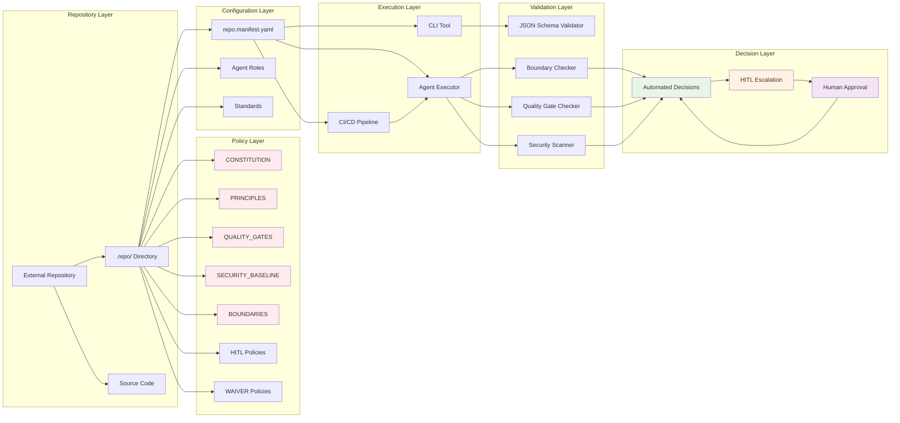
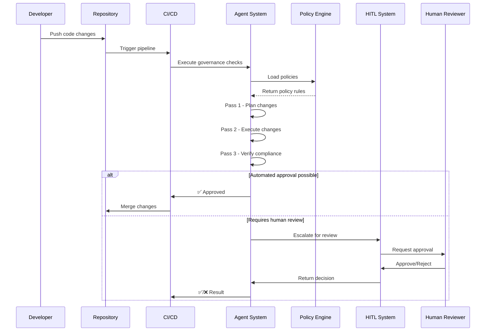
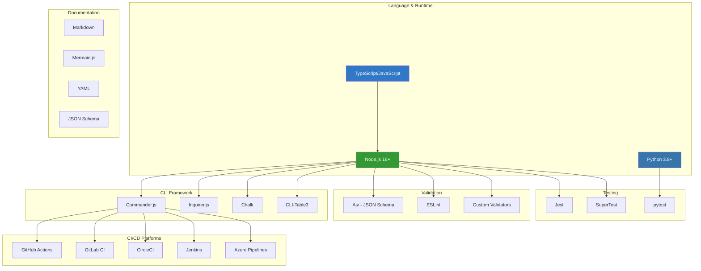
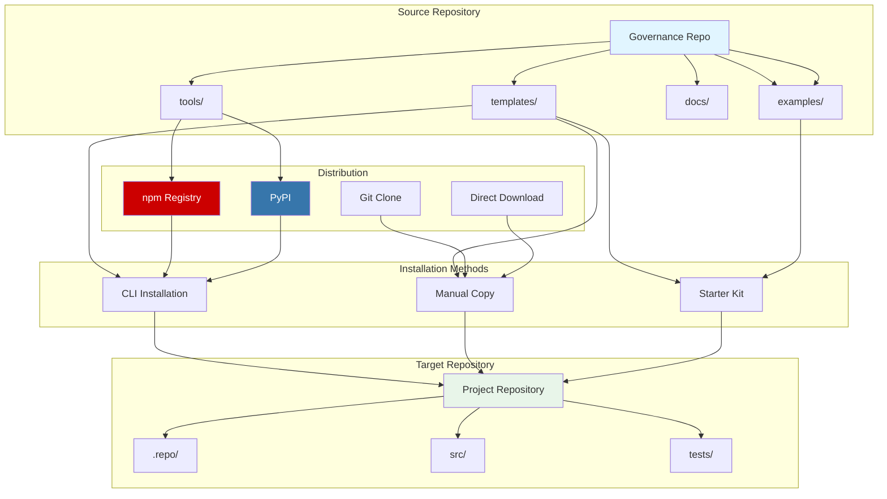
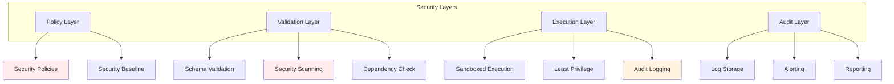

# System Architecture Diagram

## Overview

This diagram shows the complete architecture of the AI-Native Governance System, including all major components, their relationships, data flow, and integration points.

## High-Level System Architecture

```mermaid
graph TB
    subgraph "External Repos"
        REPO[Repository]
        REPO_FILES[Source Code]
        REPO_GOV[.repo/ Governance]
        REPO --> REPO_FILES
        REPO --> REPO_GOV
    end

    subgraph "Governance Framework"
        POLICIES[Policy Files]
        MANIFEST[repo.manifest.yaml]
        AGENTS[Agent Framework]
        TEMPLATES[Templates]
        
        POLICIES --> CONST[CONSTITUTION]
        POLICIES --> PRINC[PRINCIPLES]
        POLICIES --> QG[QUALITY_GATES]
        POLICIES --> SEC[SECURITY_BASELINE]
        POLICIES --> BOUND[BOUNDARIES]
        POLICIES --> HITL[HITL]
        POLICIES --> WAIVE[WAIVERS]
    end

    subgraph "CLI Tools"
        CLI[governance-cli]
        CLI --> INIT[init]
        CLI --> VAL[validate]
        CLI --> VER[verify]
        CLI --> UPDATE[update]
        CLI --> CHECK[check-updates]
    end

    subgraph "CI/CD Integration"
        CICD[CI/CD Pipeline]
        CICD --> BUILD[Build Stage]
        CICD --> TEST[Test Stage]
        CICD --> GOV_CHECK[Governance Stage]
        CICD --> SEC_SCAN[Security Stage]
        CICD --> DEPLOY[Deploy Stage]
    end

    subgraph "Agent System"
        AGENT_EXEC[Agent Executor]
        AGENT_EXEC --> PASS1[Pass 1: Plan]
        AGENT_EXEC --> PASS2[Pass 2: Change]
        AGENT_EXEC --> PASS3[Pass 3: Verify]
        
        PASS3 --> BOUND_CHECK[Boundary Checker]
        PASS3 --> QG_CHECK[Quality Gate Checker]
        PASS3 --> SEC_CHECK[Security Checker]
    end

    subgraph "Human-in-the-Loop"
        HUMAN[Human Reviewer]
        HITL_SYS[HITL System]
        WAIVER_SYS[Waiver System]
        
        HITL_SYS --> HUMAN
        WAIVER_SYS --> HUMAN
    end

    subgraph "Validation & Enforcement"
        VALIDATOR[Schema Validator]
        BOUNDARY_TOOL[Boundary Analyzer]
        QUALITY_TOOL[Quality Analyzer]
        SECURITY_TOOL[Security Scanner]
    end

    %% Connections
    REPO_GOV --> POLICIES
    REPO_GOV --> MANIFEST
    REPO_GOV --> AGENTS
    
    CLI --> REPO_GOV
    CLI --> VALIDATOR
    
    CICD --> CLI
    CICD --> AGENT_EXEC
    CICD --> VALIDATOR
    
    AGENT_EXEC --> POLICIES
    AGENT_EXEC --> MANIFEST
    AGENT_EXEC --> HITL_SYS
    
    BOUND_CHECK --> BOUNDARY_TOOL
    QG_CHECK --> QUALITY_TOOL
    SEC_CHECK --> SECURITY_TOOL
    
    VALIDATOR --> MANIFEST
    BOUNDARY_TOOL --> BOUND
    QUALITY_TOOL --> QG
    SECURITY_TOOL --> SEC
    
    PASS3 --> HITL_SYS
    HITL_SYS --> WAIVER_SYS
    
    style POLICIES fill:#e1f5ff
    style AGENT_EXEC fill:#fff3e0
    style HUMAN fill:#f3e5f5
    style VALIDATOR fill:#e8f5e9
```

## Detailed Component Architecture

## Data Flow Architecture

## Technology Stack

## Deployment Model

## Key Components

### Policy Files
- **CONSTITUTION**: Core governance rules (immutable)
- **PRINCIPLES**: Development principles (P3-P25)
- **QUALITY_GATES**: Quality thresholds and gates
- **SECURITY_BASELINE**: Security requirements
- **BOUNDARIES**: Architectural boundaries
- **HITL**: Human-in-the-loop policies
- **WAIVERS**: Waiver management

### Configuration
- **repo.manifest.yaml**: Project-specific configuration
- **Agent Roles**: Role definitions and permissions
- **Standards**: Documentation and coding standards

### Tools
- **CLI**: Command-line interface for governance operations
- **Validators**: Schema and policy validators
- **Analyzers**: Boundary and quality analyzers
- **Scanners**: Security and vulnerability scanners

### Workflows
- **Agent Execution**: Three-pass automated workflow
- **CI/CD Integration**: Pipeline integration
- **HITL System**: Human review and approval
- **Waiver Management**: Exception tracking

## Integration Points

1. **Version Control**: Git integration for tracking changes
2. **CI/CD Platforms**: GitHub Actions, GitLab CI, CircleCI, Jenkins, Azure
3. **Code Analysis**: ESLint, pylint, custom analyzers
4. **Security Scanning**: Dependency scanners, SAST tools
5. **Communication**: Slack, Teams, email notifications
6. **Issue Tracking**: GitHub Issues, Jira, Linear
7. **Documentation**: Markdown, wikis, documentation sites

## Scalability Considerations

### Horizontal Scaling
- CLI tools are stateless
- CI/CD jobs run in parallel
- Multiple agents can execute independently

### Vertical Scaling
- Policy evaluation is cached
- Incremental validation
- Lazy loading of governance files

### Performance Targets
- CLI init: < 5 seconds
- Validation: < 10 seconds
- Full verification: < 60 seconds
- Agent execution: < 5 minutes per pass

## Security Architecture

## Related Documentation

- **Architecture Overview**: `/docs/architecture/ARCHITECTURE_OVERVIEW.md`
- **Agent Architecture**: `/docs/architecture/AGENT_ARCHITECTURE.md`
- **Security Architecture**: `/docs/architecture/SECURITY_ARCHITECTURE.md`
- **CLI Reference**: `/docs/reference/CLI_REFERENCE.md`

---

**Last Updated:** 2026-01-22  
**Version:** 1.0.0
