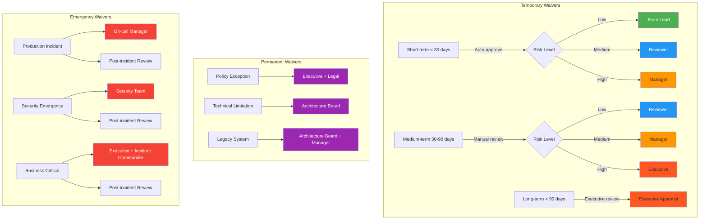
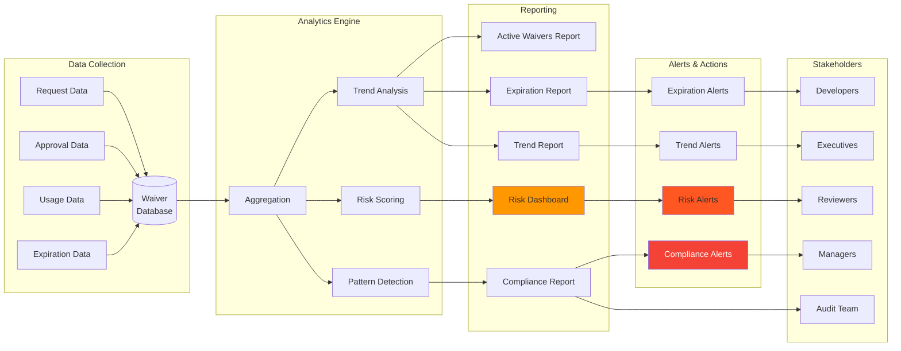
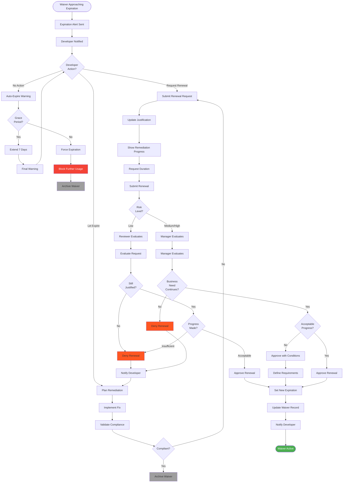

# Waiver Lifecycle

## Overview

The Waiver Lifecycle diagram illustrates the complete process of requesting, evaluating, approving, tracking, and managing governance waivers. Waivers provide a controlled mechanism to temporarily or permanently bypass governance policies when there is a legitimate business need, while maintaining full audit trails and compliance requirements.

The waiver system balances flexibility with control, allowing development to proceed when strict policy compliance is not feasible, while ensuring that exceptions are properly justified, time-limited, and tracked. All waivers require documentation, approval, and regular review to prevent policy erosion.

## Complete Waiver Lifecycle

```mermaid
stateDiagram-v2
    [*] --> ViolationDetected: Policy Violation Found
    
    ViolationDetected --> RequestInitiated: Developer Initiates Request
    
    RequestInitiated --> InformationGathering: Collect Details
    
    state InformationGathering {
        [*] --> ViolationType
        ViolationType --> Justification
        Justification --> AlternativesConsidered
        AlternativesConsidered --> ProposedDuration
        ProposedDuration --> RiskAssessment
        RiskAssessment --> [*]
    }
    
    InformationGathering --> RequestSubmitted: Submit Complete Request
    
    RequestSubmitted --> AutomatedEvaluation: System Evaluates
    
    state AutomatedEvaluation {
        [*] --> CheckPolicy
        CheckPolicy --> CalculateRisk
        CalculateRisk --> CheckHistory
        CheckHistory --> DetermineRoute
        DetermineRoute --> [*]
    }
    
    AutomatedEvaluation --> AutoApproved: Auto-Approval Criteria Met
    AutomatedEvaluation --> RequiresReview: Manual Review Required
    AutomatedEvaluation --> AutoRejected: Policy Prohibits
    
    AutoApproved --> Active: Waiver Granted (Auto)
    
    RequiresReview --> ReviewerAssigned: Assign Reviewer
    
    ReviewerAssigned --> UnderReview: Reviewer Evaluating
    
    UnderReview --> NeedMoreInfo: Information Insufficient
    NeedMoreInfo --> InfoRequested: Request Additional Details
    InfoRequested --> InfoProvided: Developer Responds
    InfoProvided --> UnderReview: Continue Review
    
    UnderReview --> ReviewerDecision: Review Complete
    
    state ReviewerDecision <<choice>>
    ReviewerDecision --> ReviewerApproved: Approve
    ReviewerDecision --> ReviewerRejected: Reject
    ReviewerDecision --> EscalateHigher: Escalate
    
    ReviewerApproved --> ManagerReview: High Risk/Value
    ReviewerApproved --> Active: Standard Approval
    
    ManagerReview --> ManagerEvaluating: Manager Reviews
    
    state ManagerEvaluating {
        [*] --> BusinessImpact
        BusinessImpact --> RiskReview
        RiskReview --> StrategicAlignment
        StrategicAlignment --> FinalDecision
        FinalDecision --> [*]
    }
    
    ManagerEvaluating --> ManagerApproved: Approved
    ManagerEvaluating --> ManagerRejected: Rejected
    ManagerEvaluating --> ExecutiveEscalation: Escalate to Executive
    
    ManagerApproved --> Active: Waiver Granted (Manager)
    
    ExecutiveEscalation --> ExecutiveReview: Executive Reviews
    ExecutiveReview --> ExecutiveApproved: Approved
    ExecutiveReview --> ExecutiveRejected: Rejected
    
    ExecutiveApproved --> Active: Waiver Granted (Executive)
    
    ReviewerRejected --> Rejected: Waiver Denied
    ManagerRejected --> Rejected: Waiver Denied
    ExecutiveRejected --> Rejected: Waiver Denied
    AutoRejected --> Rejected: Waiver Denied
    EscalateHigher --> ManagerReview: Escalated
    
    Active --> InUse: Applied to Changes
    
    state Active {
        [*] --> Monitoring
        Monitoring --> PeriodicReview
        PeriodicReview --> CheckExpiration
        CheckExpiration --> Monitoring
    }
    
    InUse --> Used: Changes Merged
    
    Active --> ExpirationWarning: Approaching Expiration
    ExpirationWarning --> RenewalRequested: Request Renewal
    ExpirationWarning --> Expired: Time Limit Reached
    
    RenewalRequested --> RenewalReview: Review Renewal
    RenewalReview --> RenewalApproved: Approved
    RenewalReview --> RenewalRejected: Rejected
    
    RenewalApproved --> Active: Renewed
    RenewalRejected --> Expired: Not Renewed
    
    Active --> PolicyChange: Policy Updated
    PolicyChange --> RevalidationRequired: Re-evaluate Waiver
    
    RevalidationRequired --> StillValid: Still Applicable
    RevalidationRequired --> NoLongerValid: No Longer Applicable
    
    StillValid --> Active: Continue
    NoLongerValid --> Revoked: Waiver Revoked
    
    Active --> IssueDiscovered: Problem Found
    IssueDiscovered --> IncidentReview: Investigate
    IncidentReview --> RevokeDecision: Review Outcome
    
    RevokeDecision --> Revoked: Revoke Waiver
    RevokeDecision --> Active: Continue with Conditions
    
    Used --> PostMergeReview: Periodic Audit
    PostMergeReview --> StillNeeded: Still Required
    PostMergeReview --> NoLongerNeeded: Can Be Removed
    
    StillNeeded --> Archived: Archive Record
    NoLongerNeeded --> Remediated: Issue Fixed
    
    Remediated --> Archived: Archive Record
    Expired --> Archived: Archive Record
    Revoked --> Archived: Archive Record
    Rejected --> Archived: Archive Record
    
    Archived --> [*]: Lifecycle Complete
    
    note right of AutomatedEvaluation
        Criteria:
        - Violation Type
        - Risk Score
        - Requester Authority
        - Historical Data
        - Policy Rules
    end note
    
    note right of Active
        Active waivers include:
        - Start Date
        - Expiration Date
        - Scope Definition
        - Conditions
        - Review Schedule
    end note
    
    note right of Archived
        Archived records retained for:
        - Audit Trail
        - Compliance
        - Analytics
        - Policy Review
    end note
```



## Waiver Request and Evaluation Flow

```mermaid
graph TB
    Start([Policy Violation Detected]) --> Detect[Identify Violation]
    
    Detect --> DevDecision{Developer<br/>Decision}
    
    DevDecision -->|Fix Issue| DevFix[Modify Code to Comply]
    DevFix --> NoWaiver([No Waiver Needed])
    
    DevDecision -->|Request Waiver| InitRequest[Initiate Waiver Request]
    
    InitRequest --> Form[Complete Waiver Form]
    
    Form --> F1[Violation Type & Details]
    Form --> F2[Business Justification]
    Form --> F3[Alternatives Considered]
    Form --> F4[Risk Assessment]
    Form --> F5[Proposed Duration]
    Form --> F6[Mitigation Measures]
    Form --> F7[Supporting Evidence]
    
    F1 --> Validation[Validate Form]
    F2 --> Validation
    F3 --> Validation
    F4 --> Validation
    F5 --> Validation
    F6 --> Validation
    F7 --> Validation
    
    Validation --> Valid{Form<br/>Complete?}
    
    Valid -->|No| Feedback[Provide Feedback]
    Feedback --> Form
    
    Valid -->|Yes| Submit[Submit Request]
    
    Submit --> AutoEval[Automated Evaluation]
    
    AutoEval --> AE1[Check Policy Rules]
    AE1 --> AE2{Auto-Approval<br/>Allowed?}
    
    AE2 -->|No - Prohibited| AutoReject[Automatic Rejection]
    AutoReject --> RejectNotify[Notify Developer]
    RejectNotify --> RejectEnd([Waiver Rejected])
    
    AE2 -->|Yes - Possible| AE3[Calculate Risk Score]
    
    AE3 --> RiskCalc[Risk Calculation]
    
    RiskCalc --> RC1[Severity: Impact Level]
    RiskCalc --> RC2[Scope: Affected Systems]
    RiskCalc --> RC3[Duration: Time Period]
    RiskCalc --> RC4[History: Past Violations]
    RiskCalc --> RC5[Requester: Authority Level]
    
    RC1 --> RiskScore[Aggregate Risk Score]
    RC2 --> RiskScore
    RC3 --> RiskScore
    RC4 --> RiskScore
    RC5 --> RiskScore
    
    RiskScore --> RiskLevel{Risk<br/>Level?}
    
    RiskLevel -->|Low Risk| AutoApprovalCheck{Auto-Approve<br/>Criteria}
    
    AutoApprovalCheck -->|All Met| AutoApprove[Automatic Approval]
    AutoApprove --> SetExpiration[Set Expiration Date]
    SetExpiration --> CreateRecord[Create Waiver Record]
    CreateRecord --> NotifyApproved[Notify Developer]
    NotifyApproved --> ActiveState([Waiver Active])
    
    AutoApprovalCheck -->|Not All Met| RouteReviewer
    
    RiskLevel -->|Medium Risk| RouteReviewer[Route to Reviewer]
    RiskLevel -->|High Risk| RouteManager[Route to Manager]
    RiskLevel -->|Critical Risk| RouteExecutive[Route to Executive]
    
    RouteReviewer --> AssignReviewer[Assign Reviewer]
    AssignReviewer --> ReviewerQueue[Add to Review Queue]
    ReviewerQueue --> ReviewerEval[Reviewer Evaluation]
    
    ReviewerEval --> RE1[Review Justification]
    RE1 --> RE2[Assess Risk]
    RE2 --> RE3[Validate Alternatives]
    RE3 --> RE4[Check Precedents]
    RE4 --> ReviewerDecision{Reviewer<br/>Decision}
    
    ReviewerDecision -->|Need Info| RequestInfo[Request Additional Info]
    RequestInfo --> DevRespond[Developer Provides Info]
    DevRespond --> ReviewerEval
    
    ReviewerDecision -->|Reject| RevReject[Document Rejection]
    RevReject --> NotifyReject[Notify Developer]
    NotifyReject --> RejectEnd
    
    ReviewerDecision -->|Approve| RevApprove[Document Approval]
    RevApprove --> SetConditions[Set Conditions & Duration]
    SetConditions --> CreateRecord
    
    ReviewerDecision -->|Escalate| RouteManager
    
    RouteManager --> AssignManager[Assign Manager]
    AssignManager --> ManagerQueue[Add to Manager Queue]
    ManagerQueue --> ManagerEval[Manager Evaluation]
    
    ManagerEval --> ME1[Business Impact Analysis]
    ME1 --> ME2[Risk vs Benefit]
    ME2 --> ME3[Strategic Alignment]
    ME3 --> ME4[Compliance Check]
    ME4 --> ManagerDecision{Manager<br/>Decision}
    
    ManagerDecision -->|Reject| MgrReject[Document Rejection]
    MgrReject --> NotifyReject
    
    ManagerDecision -->|Approve| MgrApprove[Document Approval]
    MgrApprove --> SetConditions
    
    ManagerDecision -->|Escalate| RouteExecutive
    
    RouteExecutive --> AssignExec[Assign Executive]
    AssignExec --> ExecQueue[Add to Executive Queue]
    ExecQueue --> ExecEval[Executive Evaluation]
    
    ExecEval --> EE1[Strategic Impact]
    EE1 --> EE2[Organizational Risk]
    EE2 --> EE3[Policy Exception]
    EE3 --> ExecDecision{Executive<br/>Decision}
    
    ExecDecision -->|Reject| ExecReject[Document Rejection]
    ExecReject --> NotifyReject
    
    ExecDecision -->|Approve| ExecApprove[Document Approval]
    ExecApprove --> SetConditions
    
    style ActiveState fill:#4caf50,color:#fff
    style NoWaiver fill:#4caf50,color:#fff
    style RejectEnd fill:#f44336,color:#fff
    style AutoReject fill:#ff5722
    style RouteReviewer fill:#2196f3,color:#fff
    style RouteManager fill:#ff9800
    style RouteExecutive fill:#ff5722
```



## Waiver Monitoring and Expiration

```mermaid
sequenceDiagram
    participant System
    participant Waiver
    participant Monitor
    participant Reviewer
    participant Developer
    participant AuditLog
    
    Note over System,AuditLog: Active Waiver Monitoring
    
    System->>Waiver: Check Status (Daily)
    
    loop Daily Monitoring
        Waiver->>Monitor: Get Active Waivers
        Monitor->>Monitor: Check Each Waiver
        
        alt Usage Tracking
            Monitor->>Waiver: Is Waiver Being Used?
            Waiver-->>Monitor: Usage Metrics
            Monitor->>AuditLog: Log Usage
        end
        
        alt Expiration Check
            Monitor->>Waiver: Days Until Expiration?
            
            alt < 7 Days
                Waiver-->>Monitor: Expiring Soon
                Monitor->>Developer: Warning: Expiring in X days
                Monitor->>Reviewer: Notification: Review Needed
                Monitor->>AuditLog: Log Expiration Warning
                
                alt Developer Action
                    Developer->>Monitor: Request Renewal
                    Monitor->>Reviewer: Renewal Request
                    Reviewer->>Reviewer: Evaluate Renewal
                    
                    alt Renewal Approved
                        Reviewer->>Waiver: Extend Expiration
                        Waiver-->>Developer: Renewal Granted
                        Monitor->>AuditLog: Log Renewal
                    else Renewal Denied
                        Reviewer->>Developer: Renewal Denied
                        Reviewer->>Developer: Plan Remediation
                        Monitor->>AuditLog: Log Denial
                    end
                else No Action
                    Note over Developer: No renewal requested
                end
            else Expired
                Waiver-->>Monitor: Expired
                Monitor->>System: Deactivate Waiver
                System->>Developer: Waiver Expired - Action Required
                System->>AuditLog: Log Expiration
                
                alt Has Active Usage
                    System->>System: Block Future Usage
                    System->>Developer: Critical: Update Required
                    System->>Reviewer: Escalation: Active Usage
                else No Active Usage
                    System->>System: Archive Waiver
                    System->>AuditLog: Archive Record
                end
            end
        end
        
        alt Compliance Check
            Monitor->>Waiver: Check Compliance
            Waiver-->>Monitor: Conditions Status
            
            alt Conditions Violated
                Monitor->>Reviewer: Alert: Conditions Violated
                Monitor->>System: Flag for Review
                Reviewer->>Reviewer: Investigate Violation
                
                alt Revoke Decision
                    Reviewer->>Waiver: Revoke Waiver
                    Waiver->>Developer: Waiver Revoked
                    System->>AuditLog: Log Revocation
                else Continue with Warning
                    Reviewer->>Developer: Warning Issued
                    System->>AuditLog: Log Warning
                end
            end
        end
        
        alt Policy Change Detection
            Monitor->>System: Check for Policy Updates
            
            alt Policy Changed
                System->>Monitor: Policy Updated
                Monitor->>Waiver: Revalidate Against New Policy
                
                alt Still Valid
                    Waiver-->>Monitor: Valid
                    Monitor->>AuditLog: Log Revalidation
                else No Longer Valid
                    Waiver-->>Monitor: Invalid
                    Monitor->>Reviewer: Review Required
                    Reviewer->>Waiver: Update or Revoke
                    System->>AuditLog: Log Policy Impact
                end
            end
        end
    end
    
    Note over System,AuditLog: Periodic Audit Review
    
    System->>Monitor: Quarterly Audit Trigger
    Monitor->>Monitor: Generate Waiver Report
    Monitor->>Reviewer: Audit Report
    
    Reviewer->>Reviewer: Review All Active Waivers
    Reviewer->>System: Audit Recommendations
    System->>AuditLog: Log Audit Results
```



## Waiver Types and Approval Authority



## Waiver Tracking and Analytics



## Waiver Renewal Process



## Key Principles

### 1. Controlled Flexibility
Waivers provide necessary flexibility while maintaining governance integrity. Every exception is documented, justified, and time-limited.

### 2. Proportional Authority
Approval authority scales with risk level. Low-risk waivers can be auto-approved, while high-risk waivers require executive approval.

### 3. Temporal Bounds
All waivers have expiration dates. Permanent waivers are rare and require extraordinary justification and authority.

### 4. Continuous Monitoring
Active waivers are continuously monitored for compliance, usage, and expiration. Automated alerts prevent surprises.

### 5. Full Auditability
Complete audit trail from request through expiration. Every decision, approval, and action is logged.

### 6. Remediation Focus
Waivers are temporary solutions. Renewal requires demonstrated progress toward permanent remediation.

## Practical Examples

### Example 1: Low-Risk Auto-Approved Waiver

```
Scenario: Temporary API rate limit increase for load testing
Request Details:
  - Violation: API call rate exceeds standard limit
  - Justification: Load testing scheduled for next week
  - Duration: 7 days
  - Risk: Low (test environment only)
  - Alternatives: Considered synthetic testing (insufficient)
  - Mitigation: Automated revert after test period

Timeline:
  00:00 - Request submitted
  00:01 - Automated evaluation
  00:02 - Risk calculated: LOW
  00:03 - Auto-approved (duration < 30 days, low risk, test env)
  00:04 - Waiver active, expiration set for 7 days
  
Day 7 - Automatic expiration
Day 8 - Waiver archived

Human involvement: None
Outcome: Successful, no issues
```

### Example 2: Medium-Risk Waiver Requiring Review

```
Scenario: Skip integration tests for hotfix deployment
Request Details:
  - Violation: Integration test suite not run
  - Justification: Critical production bug, customer impact
  - Duration: Single deployment
  - Risk: Medium (production impact possible)
  - Alternatives: Considered full test run (24hr delay unacceptable)
  - Mitigation: Manual testing, gradual rollout, quick rollback plan

Timeline:
  00:00 - Request submitted (emergency context)
  00:05 - Automated evaluation: Medium risk
  00:06 - Routed to reviewer (on-call architect)
  00:15 - Reviewer evaluates
  00:20 - Additional info requested (rollback plan)
  00:25 - Developer provides details
  00:30 - Approved with conditions:
          * Manual smoke testing required
          * Gradual rollout (10% → 50% → 100%)
          * 24hr monitoring
          * Post-incident review
  00:35 - Waiver active
  02:00 - Hotfix deployed successfully
  26:00 - Post-incident review completed
  26:30 - Waiver archived

Human involvement: Reviewer evaluation + post-incident review
Outcome: Successful, lessons learned documented
```

### Example 3: High-Risk Waiver Requiring Management Approval

```
Scenario: Deploy with known security vulnerability (vendor patch pending)
Request Details:
  - Violation: High severity security issue present
  - Justification: Feature critical for major customer contract
  - Duration: 30 days (vendor patch ETA: 3 weeks)
  - Risk: High (security exposure)
  - Alternatives: Considered delaying feature (contract risk)
  - Mitigation: WAF rules, monitoring, access restrictions

Timeline:
  Day 1, 09:00 - Request submitted
  Day 1, 09:15 - Automated evaluation: High risk
  Day 1, 09:20 - Routed to security reviewer
  Day 1, 10:00 - Security reviewer evaluates
  Day 1, 10:30 - Escalated to manager (high risk + security)
  Day 1, 14:00 - Manager reviews business context
  Day 1, 14:30 - Consultation with security team
  Day 1, 15:00 - Approved with strict conditions:
                 * WAF rules deployed first
                 * Enhanced monitoring
                 * Weekly status updates
                 * Customer notification required
                 * Auto-revoke if exploit detected
  Day 1, 16:00 - Waiver active
  Day 5 - First status update (all conditions met)
  Day 12 - Second status update (no issues)
  Day 19 - Third status update (vendor patch available)
  Day 21 - Patch applied, vulnerability resolved
  Day 21 - Waiver closed early (remediated)
  Day 22 - Archived

Human involvement: Security review + manager approval + weekly check-ins
Outcome: Successful, patch applied ahead of schedule
```

### Example 4: Waiver Renewal with Conditions

```
Scenario: Legacy system integration requires non-standard auth (renewal)
Original Request:
  - Violation: Auth mechanism doesn't meet standards
  - Justification: Legacy system migration in progress
  - Duration: 90 days
  - Risk: Medium
  - Approval: Manager

Day 83 - Expiration warning sent
Day 85 - Developer requests renewal
          * Shows migration progress: 40% complete
          * Requests additional 60 days
          * Provides updated timeline

Day 86 - Manager reviews renewal
          * Progress acceptable but slower than planned
          * Approves 45 days (not full 60 days requested)
          * Conditions:
            - Bi-weekly progress reports
            - Must reach 75% by day 30
            - No further renewals without escalation
          
Day 86 - Renewed waiver active
Day 15 - Progress report: 55% complete (on track)
Day 30 - Progress report: 73% complete (below target)
Day 31 - Manager meeting to review status
Day 32 - Additional resources allocated
Day 45 - Migration reaches 90% complete
Day 50 - Migration complete, new auth implemented
Day 51 - Waiver closed (remediated)
Day 52 - Archived

Human involvement: Manager approval + bi-weekly reviews + intervention
Outcome: Successful with course correction
```

## Success Metrics

### Request Metrics
- **Request Volume**: Number of waiver requests per month
- **Request Type Distribution**: Breakdown by violation type
- **Request Approval Rate**: Percentage of requests approved
- **Average Processing Time**: Time from request to decision

### Risk Metrics
- **Risk Distribution**: Breakdown of waivers by risk level
- **High-Risk Waiver Count**: Number of active high-risk waivers
- **Waiver Incident Rate**: Issues caused by active waivers
- **Risk Trend**: Change in overall waiver risk over time

### Lifecycle Metrics
- **Average Duration**: Mean waiver lifetime
- **Expiration Rate**: Percentage expiring vs renewed
- **Renewal Success Rate**: Percentage of renewal requests approved
- **Remediation Rate**: Percentage of waivers leading to permanent fixes

### Compliance Metrics
- **Audit Trail Completeness**: Percentage of waivers with complete documentation
- **Condition Compliance**: Percentage of waivers meeting all conditions
- **Revocation Rate**: Percentage of waivers revoked early
- **Policy Coverage**: Percentage of policies with waiver provisions

## Best Practices

### For Requesters
1. **Justify Thoroughly**: Provide complete business context and technical rationale
2. **Consider Alternatives**: Document what else was considered and why rejected
3. **Assess Risk Honestly**: Don't downplay risks to get approval
4. **Plan Remediation**: Always have a path to permanent resolution
5. **Track Expiration**: Don't let waivers expire unexpectedly

### For Reviewers
1. **Evaluate Context**: Consider business need alongside technical risk
2. **Be Consistent**: Apply approval criteria uniformly
3. **Set Clear Conditions**: Make expectations explicit
4. **Monitor Actively**: Don't approve and forget
5. **Encourage Remediation**: Focus on permanent solutions

### For Managers
1. **Balance Risk and Need**: Make informed tradeoffs
2. **Provide Resources**: Enable remediation with budget/people
3. **Review Trends**: Look for systemic issues
4. **Update Policies**: Learn from waiver patterns
5. **Support Teams**: Remove obstacles to compliance

## Related Documentation

- [PR Workflow](./pr-workflow.md) - Integration with pull request process
- [Agent Execution Flow](./agent-execution-flow.md) - Waiver handling in agent execution
- [Authority Chain](./authority-chain.md) - Approval authority definitions
- [Boundary Model](./boundary-model.md) - Boundary violation handling
- `docs/policies/waiver-policies.md` - Waiver policy definitions
- `docs/guides/waiver-request-guide.md` - How to request waivers
- `docs/guides/waiver-review-guide.md` - How to review waiver requests

---

**Last Updated:** 2026-01-22  
**Version:** 1.0.0
